# 判断推理

## 图形推理

### 位置规律（特征：元素组成相同）

#### 平移

##### 方向

上下、左右、顺逆时针

**常见步数**
恒定、递增

###### 宫格型黑块平移

个别黑块可重合

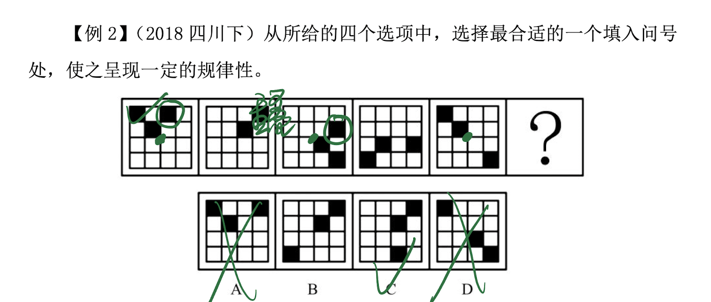

题干和选项大部分元素组成完全一致，个别一两幅图少黑块（题干第一幅图的黑块数一般是最多的，不会重合）

**黑块走到头后何去何从**
>循环走————从头开始
>反弹走————直接弹回

**"双胞胎"黑块们如何分辨————标号**

**"回"字走**

16宫格图形黑块平移，中间黑块数量相同且颜色变化

**内外圈分开看**

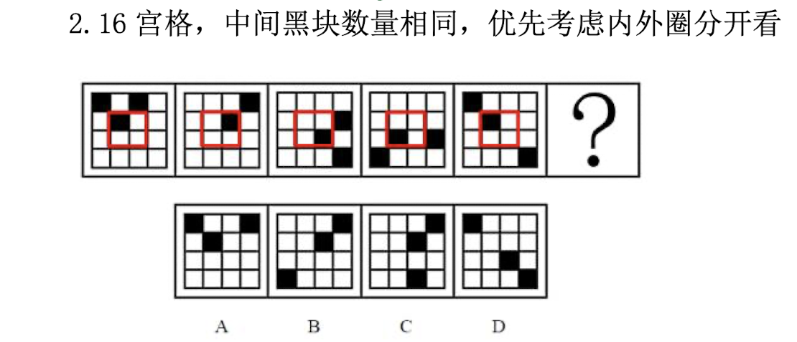

**个别黑块可重合**

题干和选项大部分元素组成完全一致，个别一两幅图因为重合少黑块（题干第一幅图的黑块数一般是最多的，不会重合）

#### 旋转

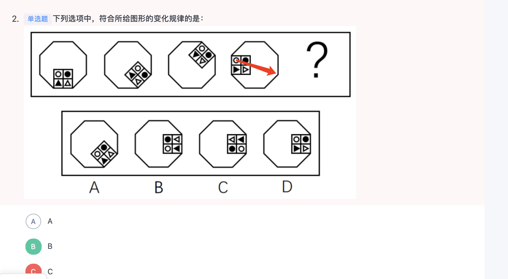

#### 翻转

### 样式规律（特征：元素组成相似--元素/线条重复出现）

#### 遍历

图形特征：相同元素重复出现

解题思维：缺啥补啥

#### 加减同异

##### 图形特征

相同线条重复出现————稍难题型：中间的图形为未知

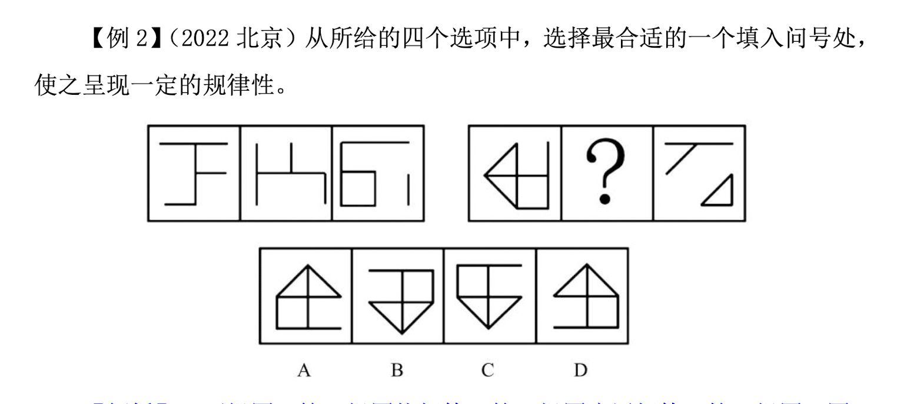

考点类型

###### 相加

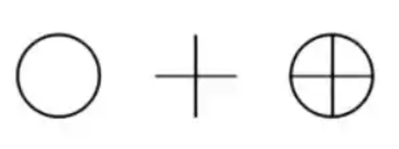

###### 相减

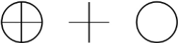

###### 求同（保留相同）

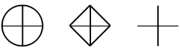

###### 求异（保留不同）

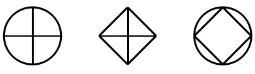

难点题型：**加减同异+旋转**：判断先转再加减、先加减再转

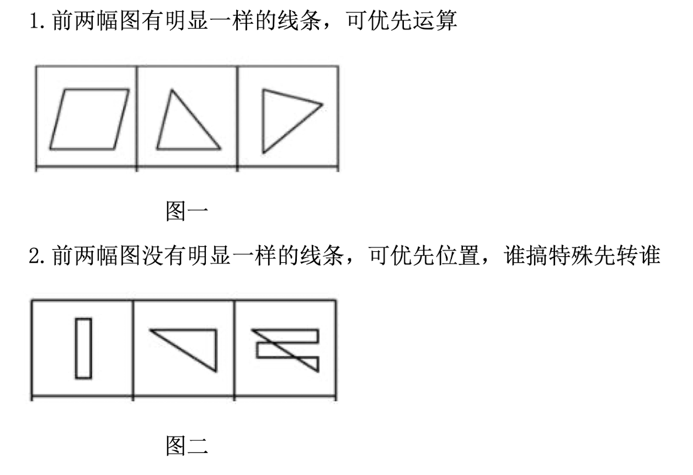

#### "黑白"运算

图形特征————图形轮廓和分割区域相同，**黑块数量不成规律**

解题技巧：按照对应位置进行"黑白"相加运算，将所得规律应用于所求图形

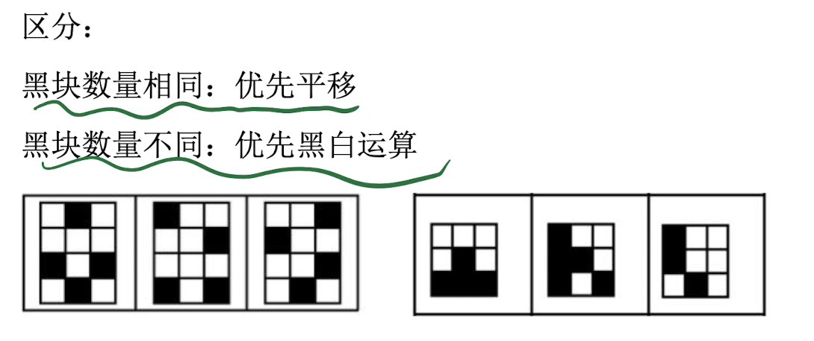

#### 一个图形等于多个图形

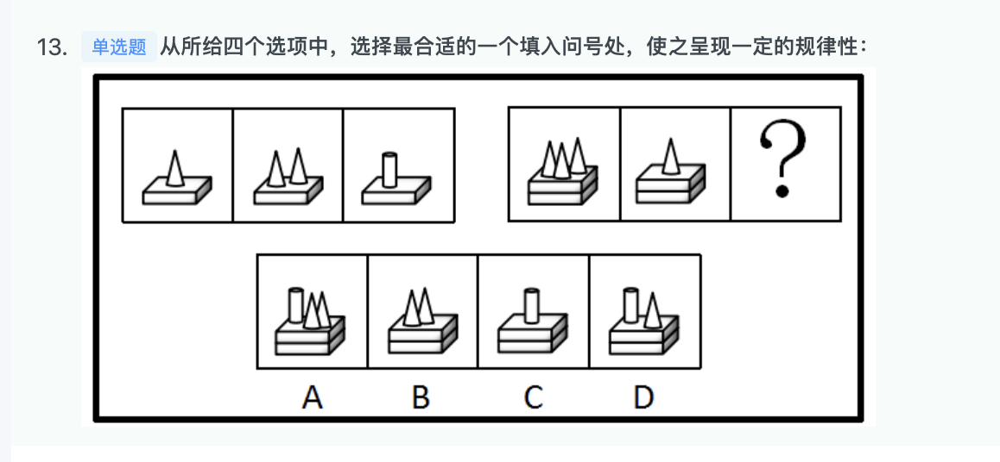

### 属性规律 (特征：元素组成不相同、不相似)

#### 对称性

##### 轴对称

特征："等腰"元素出现

**考点**

>对称轴方向
>对称轴数量
>对称轴与图形中线的关系:重合、垂直、平行
>对称轴穿过图形中面（封闭的一块空白）的数量关系
>对称轴之间的位置关系：平行、成一定夹角、垂直

##### 中心对称

特征————平行四边形、N、Z、S变形图出现

##### 轴对称+中心对称
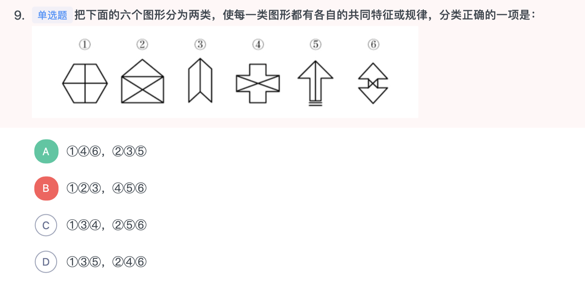

#### 曲直性

全曲线、全直线、曲线+直线

#### 开闭性

特征————完整的图形留了小开口，可以考虑开闭性

考点

##### 全封闭

##### 全开放

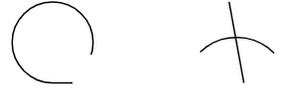

##### 半封闭

### 特殊规律

#### 图形间关系

##### 特征

题干每幅图都出现两个或多个封闭图形连在一起

##### 分类

###### 相离

###### 相交

###### 相交于面

考点：相交面的形状、相交面与图形的关系

###### 相交于点

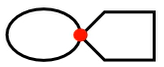

注意：一线牵图形也是相交于点

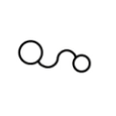

###### 相交于边

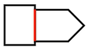

考点

相交边的数量

###### 相交边的样式

>长/短
>整体/部分

###### 相切

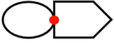

###### 相压

两图形上下覆盖，注意上下图形的区别

#### 功能元素

##### 特征

题干每幅图都出现小黑点、白点或箭头、小图形等相同小元素，优点考虑功能元素

##### 考点

标记位置

###### 标记图形————多边形的最长/最短边；标记角度；标记区直

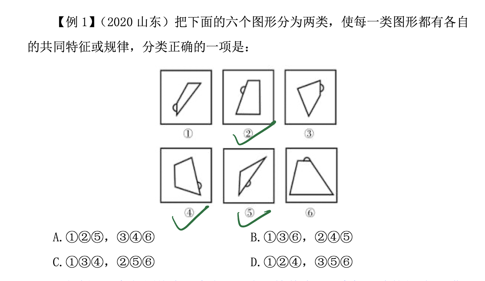

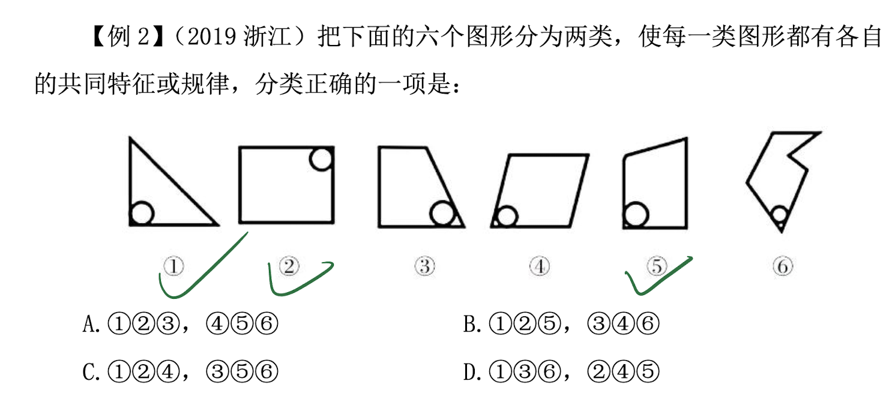

### 数量规律

#### 特征

元素组成不相同、不相似且属性无规律

数量规律明显

#### 考点

##### 面（白色的封闭区域）数量**

###### 特征

图形被分割、封闭面明显

生活化图形、粗线条图形中留空白区域

###### 数面数

###### 一般考法是数面数，当满足面特征，但整体数面无规律时，考虑面的形状
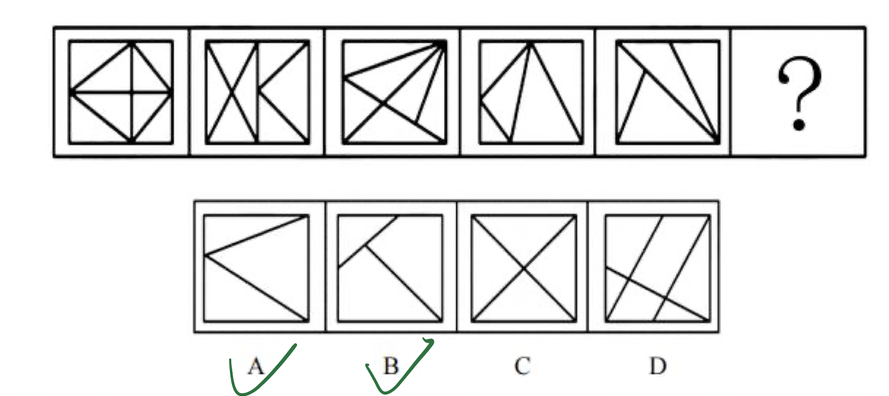

###### 所有面的形状、属性、与外框的关系————重点关注有没有三角形、四边形，关注有几个

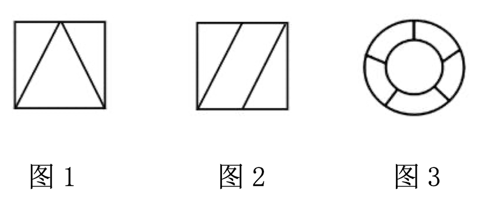

###### 相同形状面的个数

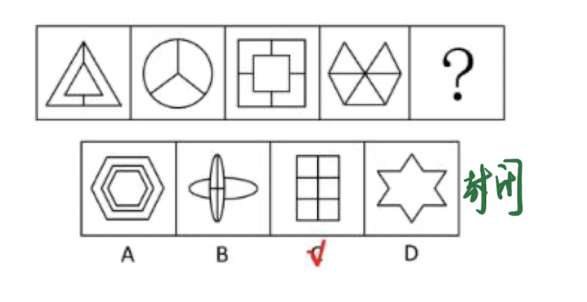

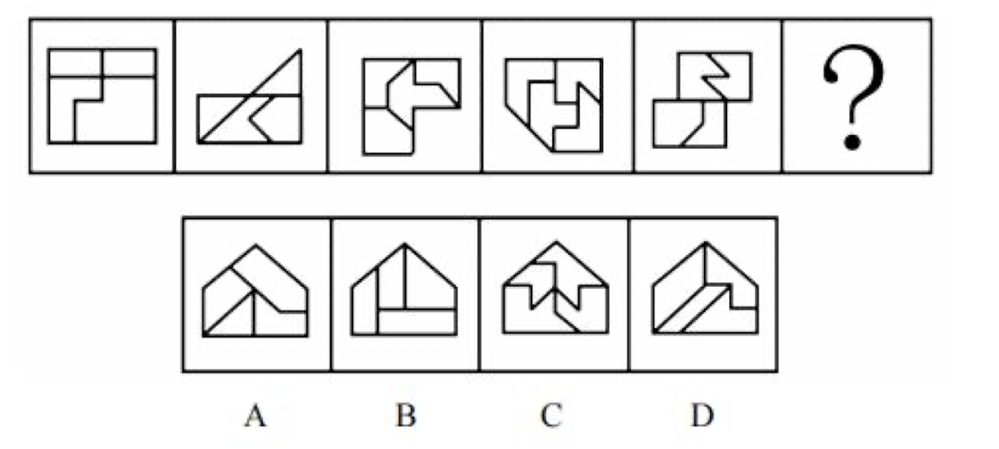

###### 最大/最小面的形状
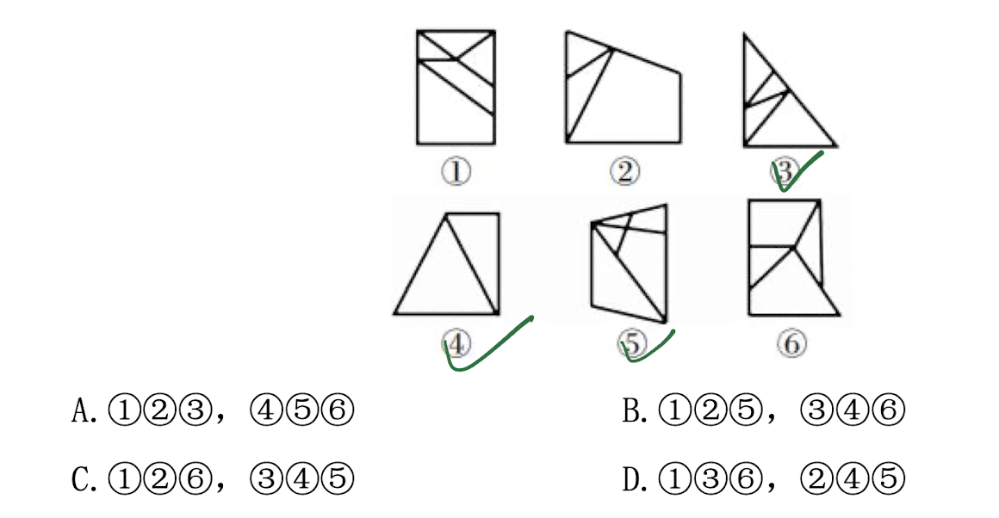

###### 其他考法：属性（对称、曲直）、与外框的关系（内外一致）

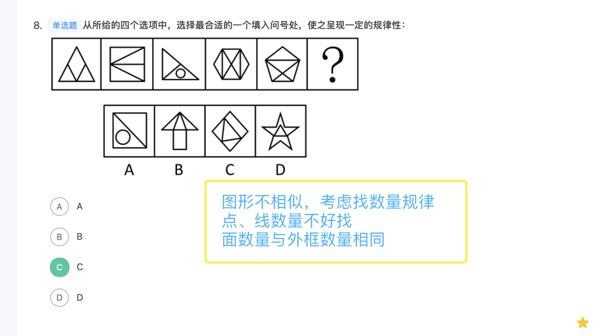

##### 线数量

特征图

###### 直线数————多边形图、或单一直线

###### 曲线数————曲线图形（单一曲线、圆、弧）

##### 笔画数

###### 一笔画

**线条之间全部连通**

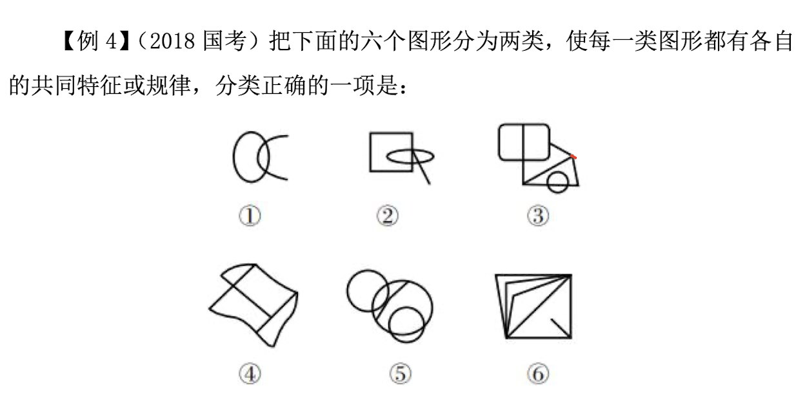

**奇点数为 0 或 2 个**

**奇点**
>发射出奇数条线的点
>所有的端点都是奇点，数奇点时要数上端点（端点易忘，要先数）
>任何图形的奇点数一定为偶数

###### 多笔画

图形笔画数=奇点数÷2（任何图形的奇点数一定为偶数）

如果存在多图形不连通，则每个部分的笔画单独算，再相加

###### 常见笔画数特征图

1. **五角星**

2. **"日"**

3. **"田"**

4. **"日"和"田"的变形图**

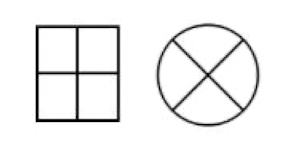

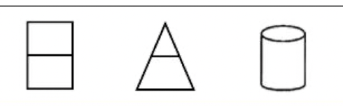

5. **圆和圆相切与相交**

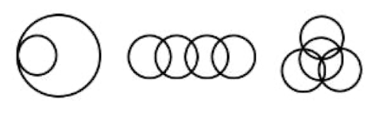

6. **出现明显多个端点（出现多端点，优先考虑笔画数）**

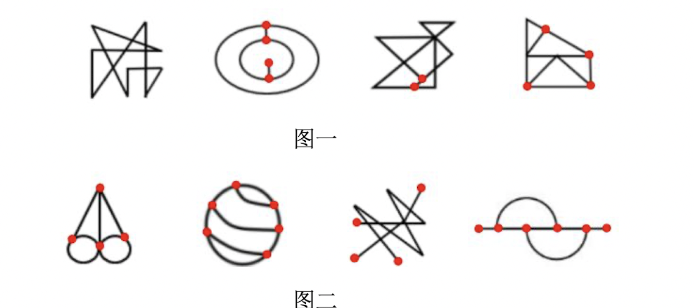

##### 点数量

###### 特征
>线条交叉明显（端点不属于交点）
>乱糟糟一团线交叉
>相切较多

###### 细化考法

1. **切点**

出现数点特征图，但整体数点无规律，且每幅图存在相切，考虑点的细化，数切点（曲线且曲线也为切点）

2. **曲直交点**

出现数点特征图，但整体数点无规律，且存在曲直相交，考虑点的细化，数曲直交点

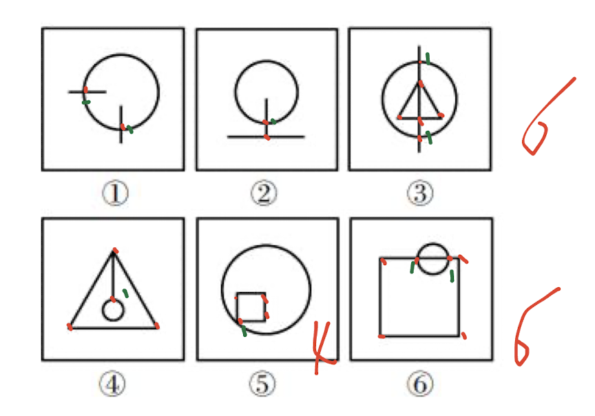

3. **内部线条与边框的交点（交点位置）**
出现数点特征图，但整体数点无规律，且存在明显框架图形
交点的位置：框上、框内、框外

##### 角数量

###### 特征图：

直角————十字交叉、T 字形、直角三角形、明显改造图形

锐角————折线、扇形、改造图：改造图即看着别扭，希望在图的基础上做增添

###### 计数规则

数角不能整体去数，类似于数面时要单独数不能整个计算。

优先数直角数量，其次数锐角数，钝角一般不考

##### 素数量————素即元素

###### 图特征

多个独立小图形（四角星、小圆圈、小心形、小月亮、小五角星等）

###### 元素个数

###### 元素种类

颜色不同算两种、形状不同也算两种

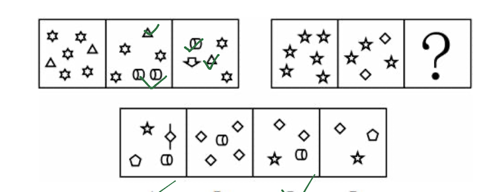

形状相同，大小不一样，一般情况算一种

###### 相邻比较

1. 相邻两幅图形找相同

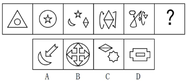

2. 每幅图形内部找相同

内部相同元素的位置

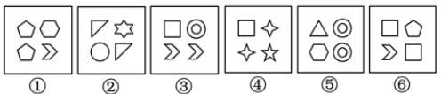

内部相同元素的数量

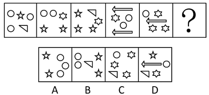

###### 部分数————图形被分为几部分

线条连在一起叫一部分

常考查生活化、粗线条图形

#### 总结

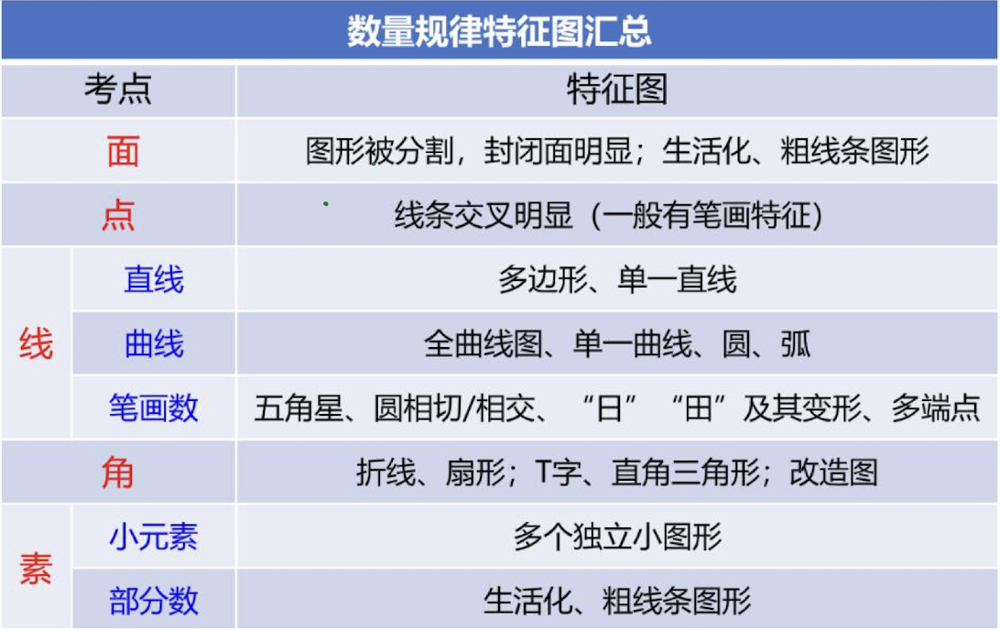

### 空间重构

#### 解题思维

注意折向————平面图为纸盒的外表面
利用相对关系和相邻关系排除错误选项

#### 六面体

##### 相对面

同行或同列相隔一个面

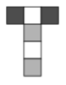

两个面在"Z"字形两端，且紧靠着"z"字形中间那条线

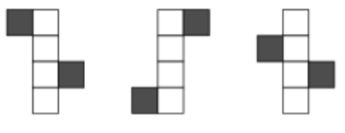

一组相对面出现 2 个的选项————排除

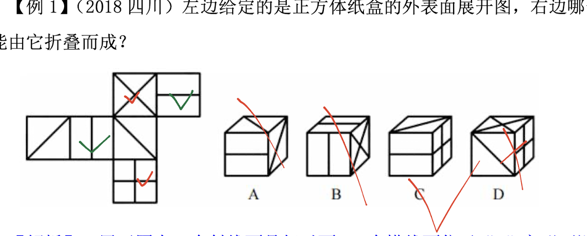

##### 相邻面

折叠前后相邻关系保持不变

##### 相对位置法

###### 辨别两个面的位置关系

**找公共边**

1. 平面图中直接相邻的两个面的公共边

2. 平面图中构成直角的两个边是同一条边

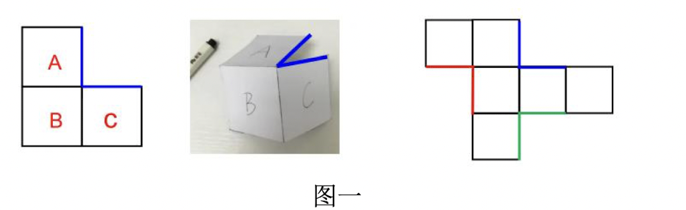

3. 一排4个面，两头的两条边是同一条边

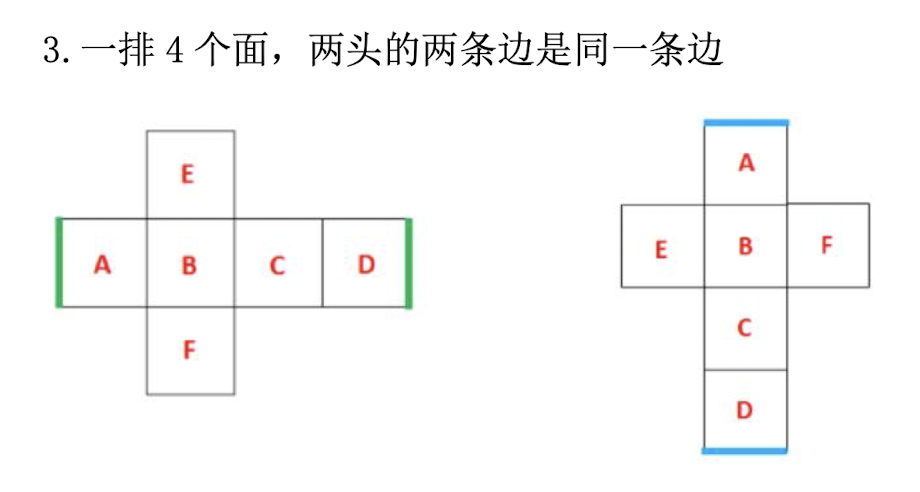

**指向性明显的图形，可以确定相对位置————箭头、三角形**

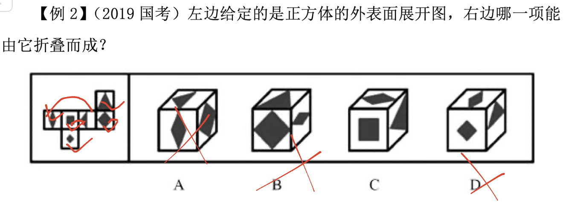

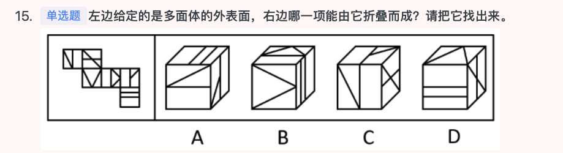

###### 辨别三个面的位置关系

**找公共点**：折叠前后由公共点引出的线保持不变

记住这个图形：从公共边确定公共点

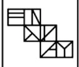

**优先次序**
>如果发现公共点连接的 3 个面挨在一起，优先考虑公共点
>如果发现公共点连接的 3 个面没有挨在一起，看公共点比较麻烦，优先考虑公共边

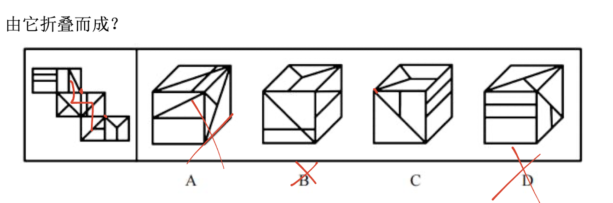

##### 画边法

结合选项，找一个特殊面的唯一点

顺/逆时针方向描边标号（描同一个面）

题干与选项对应面不一致排除

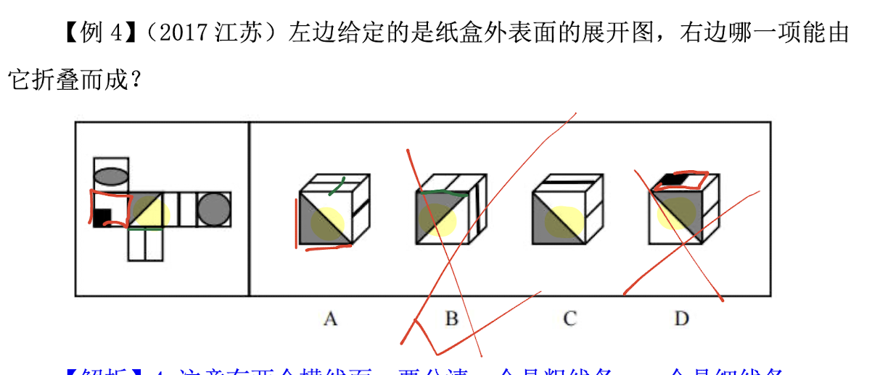

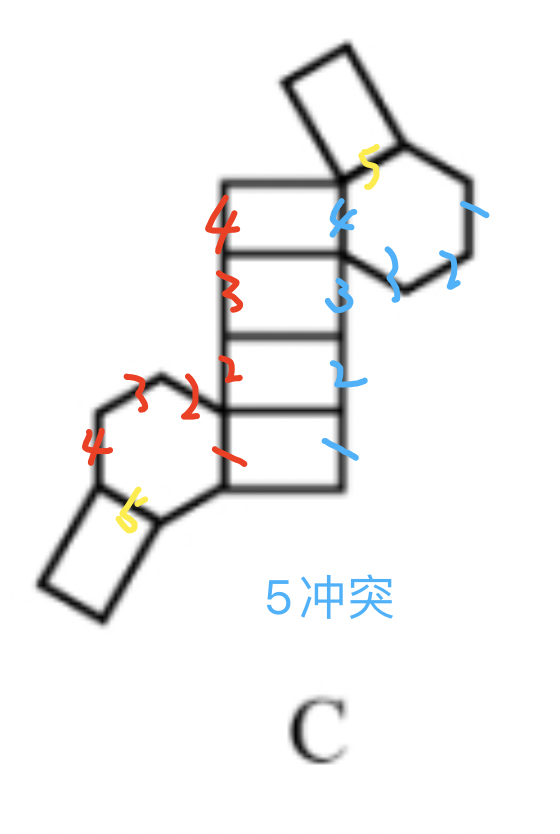

#### 三视图

**注意事项**
>观察到的三视图都是平面图
>原图有线就有线，原图没线就没线
>当被遮挡时，看不见被遮挡部分
>从与曲线面平齐的角度看，弧面会被压平

#### 截面图

定义：截面图指的是被切部分的形状

解题原则：一刀切————刀无限大，一刀切到底。

##### 常见立体截面图

1. 六面体
梯形————斜切
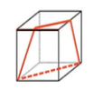

1. 圆台
圆（横切）
椭圆（斜切）

梯形（竖切）
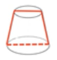

#### 立体拼合

##### 题型判定

题干给出立体图，需要找到能够拼合成该立体图形的小图形

##### 解题原则

凹凸对应：有凹必有凸，有凸必有凹

### 其他常见图形题整理

#### 补充小黑块题目

平移、旋转

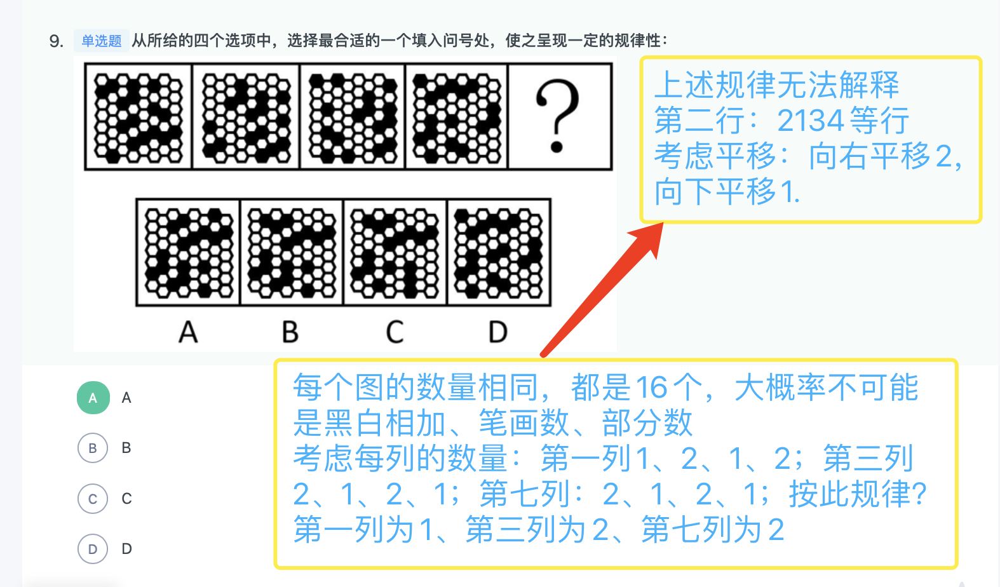


平移反弹


数数目


笔画数


黑白同异


对称


素数量


拼到一起


数量


#### 字母题


#### 横线数VS竖线数


#### 平行线数量


#### 九宫格

数字规律图1+图2=图3;图123相加为定值


#### 截面图形形状


#### 汉字题目


#### 三角形朝向


#### 两种数量规律成规律


#### 数推+图推

平移步数递增也是数量规律


#### 多个规律比较


#### 边框（PS：外部图形与内部图形相似）


### 图推题总结

大概率位置考查 1 题，样式考查 1 题、属性考查 1 题、数量考查 3 题左右、特殊规律（功能元素、图形间关系）考查 1 题、六面体考查 1 题， 剩余 2 道题是空间类的截面图、立体拼合、

## 类比推理

### 语义关系

#### 近反义关系

##### 一级辨析

**近义关系**

表示两个意思相近的词或成语，如"天真∶幼稚"，均在说一个人单纯善良。

**反义关系**
表示两个意思相反的词或成语，如"勇敢∶懦弱"，前者什么都敢干，后者什么都不敢干，二 者是反义关系。

##### 二级辨析
考虑感情色彩：褒义、中性、贬义

#### 比喻象征义

定义

把一种事物比喻成另外的事物，或者词语本身的含义同时是另外一种事物的 象征。

常见象征义


月亮∶玉盘

玫瑰∶爱情

南冠∶囚犯

桑梓∶家乡

青衿∶读书人

浮屠∶佛塔

丝竹∶音乐

汗青∶史册

同窗∶同学

桃李∶学生

手足∶兄弟

白丁/布衣∶百姓

鸿雁/笺札∶书信

总角/垂髫∶小孩

干戈/烽烟∶战争

佝偻/黄发∶老人

孺子牛：比喻心甘情愿为人民大众服务，无私奉献的人

烂摊子：比喻秩序混乱，不易收拾整顿的局面或单位

白眼狼：比喻忘恩负义、过河拆桥、恩将仇报的人

墙头草：比喻没有主见、左右摇摆、见风使舵的人

纸老虎：比喻貌似强大、实际虚弱的人或集团

及时雨：比喻在关键时刻能解救危难的人或事

冷板凳：比喻因不受重视而担任清闲的职务

捞稻草：比喻在绝望中做徒劳无益的挣扎 跑

龙套：比喻在人手下做无关紧要的事

定心丸：比喻能使人情绪安定的东西

耍花枪：比喻卖弄小聪明的欺骗行为

拉清单：比喻结算彼此的恩怨利害

破天荒：比喻从来没有出现过的事

上台阶：比喻取得新的更大的成就

笑面虎：比喻外貌和善而内心严厉凶狠的人

地头蛇：比喻凭借当地势力欺压人民的恶霸

老古董：比喻思想陈腐或生活习惯陈旧的人

应声虫：比喻象征胸无主张、随声附和的人

传声筒：比喻没有主见只会鹦鹉学舌的人

井底蛙：比喻目光短浅，见识狭隘之人

三脚猫：比喻对各种技艺略知皮毛的人

侃大山：比喻没有目的的聊天

触霉头：比喻遭遇不顺心的事

替罪羊：比喻代人受过的人

台柱子：比喻集体的骨干

马大哈：比喻粗心的人

千里马：比喻人才 印把子：比喻政权

### 逻辑关系

#### 全同关系

两个词语意思完全相同，可以画等号，就是全同关系，也叫全等关系。


例：
浪漫：罗曼蒂克
老鼠：耗子

#### 并列关系

按照同一种分类标准划分，A、B 完全不同，但处于同一层级

##### 一级辨析

###### 矛盾关系


例：

生∶死

男∶女

开∶关

对称∶不对称（A 与-A）

非并列关系：亲情∶友情 || T 恤∶冬装 || 牛油∶植物油

###### 反对关系


例：
苹果∶香蕉
黑色∶白色

###### 矛盾关系和反对关系的区别

看有没有"小三"，有"小三"的是反对 关系，没有"小三"（二人世界）的就是矛盾关系。

##### 二级辨析

出现时间早晚（传统、现代）
人力、电力

#### 包容关系

集合之间元素的从属关系


##### 种属关系——可以用什么是什么造句

例：折扇∶扇子


##### 组成关系

例：扇面∶扇子

#### 交叉关系

按不同标准划分一类事物，两个概念外延间有一部分重合的关系

例：
女士：空姐
青年：学生

**判定技巧--造句子**
**有的 A 是 B，有的 A 不是 B ；有的 B 是 A，有的 B 不是 A**


#### 对应关系

两集合元素之间有一对一关系的对应

##### 原材料和工艺

###### 二级辨析————有无新物质的生成

物理变化

>捆扎
>打磨
>雕琢
>剪裁
>织造

化学变化


>燃烧
>氧化
>发酵
>酿造
>冶炼

##### 功能

例：相机：拍照

###### 二级辨析

主要功能

次要功能 灯：装饰


##### 属性

例：盐：咸

二级辨析
必然、或然

##### 时间顺序————几个动词连续时，可以考虑时间

例：报名∶考试

二级辨析：主体是否一致

违章：罚款

##### 因果

例：炎热∶中暑

二级辨析：自然、人工原因 结果消极、积极

### 语法关系

#### 主谓关系

例：学生∶学习

二级辨析

判断主体是否一致

#### 动宾关系

例：学习∶功课

动宾短语VS单纯的动词


#### 主宾关系

例：学生∶功课

### 拆分思维

#### 考虑拆分的时机

**成语被拆分** ————成语分开（前2与后2近义、反义、因果）


**词语间无明显逻辑关系** ————成败∶呼吸 （词之间没有逻辑，词的字之间成反义）

**相同单字反复出现 ————**寒冷：寒舍（考虑单字的意思是否一致）

#### 解题技巧

两两看关系或拆成单个字看关系

相同的单字反复出现看该字在词语中的意思

### 总结


## 定义判断

### 考点一：快速识别有效信息（看得准）

#### 方法一：关键词：主体、客体。

1 主体：行为、活动的发出者。

2.客体：行为、活动作用的对象。

3.例："我爱你们"。动作是"爱"，该动作是"我"发出的，所以"我"是主体，该动作作用给"你们"，所以"你们"是客体。

4.例：主体是"企业"，借款的对象是"银行或海外"。A 项中"王明"是具体的人，不符合题干主体，直接排除，用该方法解题可能会比其他同学快。

5.主客体不符合的选项一定不符合定义，可以直接排除。


6.不是每题一定都有主体和客体，但是出现了要重点看。

7.范围越小越明确的主/客体，越容易成为考点。比如"人们、个体、团体"等主体比较宽泛，因为这个世界上除了"个体"，就是"团体"，此时主体成为考点的可能性小，但"企业"十分明确，成为考点的可能性大。

#### 方法二：句式引导词————引导的内容重点看

1.方式："通过、利用"后面**引导的具体内容**常成为考点。


2.目的："以、达到"引导目的，可能成为考点。


3.原因："因为、由于"后面引导原因。

4.结果：比如"你打了他一拳，导致他脑出血"，"导致、从而、使得"引导**结果，后面的内容**可能成为考点。


5.前提：当……时，在……情况下——引导**前提条件**

6.其他限定词：越加修饰限定词，越值得注意。比如地点、数量等限定词，比如题干要求"2 个或 2 个以上的主体"，而选项只有 1 个主体，那么该项不符合题干主体，数字类限定词修饰了主体，越加修饰，越可能成为考点。


【注意】

**"同一类型"和"不同类型"**中的"同一"和"不同"是非常明确的限定词，出现明确限定词时要注意（范围越小越容易成为考点）。


#### 方法三：解释说明

关键词：即、包括、也就是说、以下情形······

关注关键词后面内容


### 考点二：读的快

#### 1.优先看到概念所在的那句话的句号

定义句结束即可做题，其他浪费时间

【注意】

1.可以用同构选项解题的提问方式多为"不属于"。

2.定义所在句可以读懂，其他的内容可以不看。

3.定义题目不能脑补。

#### 2.多定义

##### 1.问啥看啥：看清题干问的是哪个定义，重点看目标定义。

比如多定义题目中分别给出 A 定义、B 定义、C 定义，问"不符合 C 定义的是"，优先阅读 C 定义所在的语句，这个语句可以读懂，即可直接做题，无需阅读其他语句。

##### 2.比较定义：纠结两个选项时，再与其他定义比较。
比如题干有三个定义，问第二个定义只看第二个，已经排除了 A、B 项，剩下 C、D 项进行对比，先找出 C、D 项的不同，再与题干中第一个和第三个定义对比，可能 C 项符合第一个定义，那么 D 项当选（符合第二个定义）

### 小技巧

#### 拆词

定义本身可能已经提示需要关注的关键信息，定义的所有内容浓缩为定义词的几个字，所以定义词为定义中最重要的内容。

运用：定义词本身词汇通俗易懂，优先关注。当选项纠结时，可以以此为重要破题点

#### 同构选项排除法

1.同构选项：结构相似的选项。题目都是单选题，如果一个选项正确，与他类似的选项也正确，所以可以用同构排除法。在读不懂题干时可以用同构选项进行排除。

2.解题思维：同构选项如果出现，直接排除。

### 定义判断总结：

1.看清提问，尤其是"属于"和"不属于"。

2.抓准信息：常见信息如上图所示，出现这些信息经常设置考点，但不是只要出现就有考点，信息越具体越容易出现考点，信息范围宽泛，出现考点的几率很小，学会预判。

3.选项比较：定义判断题目容易做错的原因之一是缺少比较思维。某一个选项是否正确不重要，重点是两个选项需要对比进行判断，告别死心眼，比如题目有 3 个条件，A 项符合其中 2 个条件，B 项 3 个条件均符合，那么 B 项比 A 项更符合题干。定义出现完美选项的概率非常少，一定是通过比较选择更好的选项。

4.定义本身可以抓住重要信息。

## 翻译推理

### 1.题目特征：

（1）题干和选项中存在明显的**逻辑关联词**，比如"如果……就……""只有……才……"。翻译推理题的题干一般很长，里面只有 1-2 句话需要翻译，如果选项里全部都有"如果、只有"，那么该题就是翻译推理题。

（2）常见提问方式为：可以推出/不能推出。现在还会有"以下哪种说法，除了……"的提问方法，因为问的是"除了"，所以需要选择不能推出的选项。

（3）注意利用选项帮助定题型、看清设问方式。

### 2.解题思维：

**（1）先翻译。**"翻译"即将题干中比较长的句子，以箭头的形式表示两者间的关系，即将一句话转化为一个式子。

**（2）再推理。**"推理"指结合推理规则推理出答案的过程

### 翻译规则之"前推后"：

1.典型逻辑关联词："如果……那么……"。

2.例句："如果……那么……"前推后，翻译为"你喜欢我→请我吃火锅"。

3.**简写帮助你做得快、看得清**。考试时完整地写一句话比较慢，所以无需完整地写，简写即可，可以写为"喜欢→火锅"，或者"like→（画出一口锅）"。

4.**等价关联词（前→后）**：

（1）"若……则……"，比如"你若安好，便是晴天"，"若"是"如果"的意思，"则"是"就"的意思。

（2）"只要……就……"。

（3）"所有……都……"。

（4）"为了……，一定（必须）……"。

（5）**"……是……的充分条件"。****"A 是 B 的充分条件"翻译为"A→B"****，但"充分条件"这种表述考查较少，所以没有重点讲解。**

（6）要······，就要······

eg：要满足经济社会发展科技的要求，就要不断强化科技创新对经济社会发展的战略支撑

5.无需刻意地背"如果"，需要背的是：

（1）就："如果……就……""只要……就……""要想……就……"均翻译为**前推后**。需要特别注意"只要……就……"（有一个"只"字），和"只有……才……"十分相似。

（2）都："所有……都……""全部……都……""要想……都……"均翻译为前推后。（缺少例子）

（3）一定："为了/要想/如果……一定……"均翻译为前推后的形式。

### 推理规则之"逆否等价"（重点）：

#### 1.符号表示：A→B=-B→-A

#### 2.文字表示：肯前必肯后，否后必否前，否前、肯后无必然结论/不确定（可能、可能不）。

#### 3.例句：
如果某人是北京人，那么他一定是中国人。"如果……那么……"前推后，翻译为"北京人→中国人"。

（1）张三是北京人，可以得出他是中国人。"北京人"与箭头前的内容一致，所以"北京人"是肯前，"中国人"是对箭头后内容的肯定，即肯后，所以肯前必肯后（肯前→肯后）。

（2）李四不是中国人，可以推出他一定不是北京人。"-中国人"是对箭头后的否定，即否后，"-北京人"是对箭头前的否定，即否前，所以否后必否前（否后→否前）。"肯前必肯后，否后必否前"是基本的推理规则，"→"的意思是当箭头前半部分存在时，箭头后半部分必然存在。

（3）王五不是北京人，他可能是中国人，也可能不是中国人，因为他可能是上海人、深圳人，也可能是纽约人、伦敦人，所以"-北京人→？"。"-北京人"是对箭头前的否定，即否前无必然结论。

（4）赵六是中国人，可能是上海人、北京人、香港人、台湾人，所以"中国人→？"。"中国人"是对箭头后的肯定，即肯后无必然结论。

【注意】

1.递推（穿串）：A→B，B→C，A→B→C。

2.穿"串"：能穿多少穿多少。做题的过程中尽量把句子串联在一起，注意是否逆否后可以与前两句串联。

### 翻译规则之"后推前"：

#### 典型逻辑关联词：

>只有……才……
>不……不……
>除非A否则不B（B→A）
>A是B的基础/假设/前提/关键（B→A）
>A是B的必要/必不可少的条件（B→A）

**解读：**

1."不 A 不 B"可以翻译为"B→A"或"-A→-B"，"B→A"逆否等价后就可以得出"-A→-B"。所以"不……不……"有两种翻译：

（1）带上"不"字，前推后。

（2）去掉"不"字，后推前。

（3）比如："不到长城，不是好汉"可以直接翻译为"不长城→不好汉"，也可以翻译为"好汉→长城"。

2."除非 A 否则不 B"翻译为"B→A"，需要圈出"不"字，不能落下。

3."A 是 B 的基础/假设/前提/关键/必不可少条件"直接后推前，翻译为"B→A"。


【注意】无论"前推后"、"后推前"，只要能翻译成A——&gt;B，逆否推理都能统一适用。

【注意】"因为 A 所以 B"不能写作"A→B"，"A→B"强调的是充分条件，"因为……所以……"是因果关系，二者不同

【注意】

（1）"基础/前提/关键、不可缺少/必不可少、必要条件"**意思一样**，均表示"必不可少"。

（2）原则：**谁必不可少，谁在箭头后。**

### 且和或

#### 1."且"关系：

1.**A 且 B：二者同时成立**。

2.等价关联词：A 和 B、既 A 又 B、不仅 A 而且 B、……但是……。

3.注："但是"在言语中表示转折，而在翻译推理中表示"且"关系。eg：我很丑，但是我很抢手。-丑且抢手

#### 2."或"关系：二者至少一个成立。

1.A 或 B：有 3 种情况，即"A""B""A+B"。

2.等价关联词：或者、或者……或者……、至少一个。考试中如果遇到"或者 A 或者 B"，可以直接翻译为"A 或 B"。

3.例句：我想带你去东京或者巴黎，包括 3 种情况，即"东京""巴黎""东京+巴黎"。

（1）若我带你去了东京，不确定是否去巴黎，因为"或"关系包括三种情况（"东京""巴黎""东京+巴黎"），故无法推出"去了巴黎"。

（2）若我没带你去东京，则一定去了巴黎，因为"或"关系表示二者至少一个成立，没有去东京，一定可以推出"去了巴黎"。

（3）若我没带你去巴黎，一定可以推出"去了东京"。

【注意】"或"的翻译：否其中一个1可退另一个为真。只要考查"或"关系，90%考查"否 1→1"。

1."或"关系为真，否定其中一项可以得到另一项。

2.小技巧：一个打"×"，一个保留。练习：

（1）东京或巴黎："东京"打"×"，"巴黎"保留，即"-东京→巴黎"。

（2）我不看足球或不看篮球："不看足球"打"×"，即"看足球"，"不看篮球"保留，得到"看足球→不看篮球"；"不看篮球"打"×"，即"看篮球"，"不看足球"保留，得到"看篮球→不看足球"。

（3）我不吃火锅或吃烤肉："不吃火锅"打"×"，即"吃火锅"，"吃烤肉"保留，得到"吃火锅→吃烤肉"；"吃烤肉"打"×"，即"不吃烤肉"，"不吃火锅"保留，得到"不吃烤肉→不吃火锅"。


### 德·摩根定律

1.作用：去括号。

2.口诀："-"进去，"且""或"互变。

3.-（A 且 B）＝-A 或-B。

4.-（A 或 B）＝-A 且-B。

5.例："并非"是"-"，否定后边的整体。

（1）-（方便面且大盘鸡）=-方便面或-大盘鸡。

（2）-（咖啡因或泡枸杞）=-咖啡因且-泡枸杞。


### 总结

#### 记忆点

1.如果……那么……：前推后，等价关联词是"就、都、一定"。

2.只有……才……：后推前。

（1）除非 A 否则不 B：B→A。

（2）除非 A 否则 B：-B→A。

3.谁是必不可少的，谁放在箭头后。

4.且：两者同时成立。

5.或：两者至少一个成立。

6.逆否等价推理：A→B 等价于-B→-A，否前、肯后无必然结论。

7.A 或 B 的推理规则：否一推一，其中一个画"×"，另一个保留。

8.德·摩根定律："-"进去，"且""或"互变。-（A 且 B）＝-A 或-B；-（A或 B）＝-A 且-B。

#### 推理方式：

1.提问方式：以下哪项中的推理形式/结构与题干中的推理形式/结构相同？

2.解题思维：重结构，轻内容。通常题干的表述错误，不符合逻辑关系错误，但是选项与题干错误的点一样即可，因为题干未要求选择逻辑正确的选项，而是要求选择与题干中的推理形式/结构相同的选项。

解题方法：将字母代入来做题。

技巧：题干的表述均为"是、所有"时，考虑字母代入解题。

【注意】出现"若……就……""只有……才……"等逻辑关联词，则必须写为"A→B"的形式，而不能简单地按照顺序标记 A、B，因为"只有……才……"是后推前，A 在后，B 在前。

## 组合排列

### 分类：

（1）题干信息确定：题干信息全部叙述完，最后问"由此可以推出"，即题干信息确定，**优先考虑排除法**（读一句排一句）。

出现极值（最大/最小），当比大小出现最大、最小时，找"谁不最大，谁 不最小"


遇到涉及性别的词找"谁不是男孩""谁不是女孩"进行排除


（2）题干信息不确定：指出题干的内容有错有对，即题干信息不确定，**优先考虑代入法**。


（3）特殊问法考虑代入（补充/添加以下哪项可以推出；问"可能/不可能"大概率不会有唯一结果考虑代入）

### 1.推理起点

**————不能使用排除法或者带入法，此时破题点即推理起点**

**确定信息**，例如：明确丙排在第一位

**最大信息**，题干中出现次数最多


### 2.信息复杂：列表来看

当题干给出 4 个及其以上的信息时，考虑列表格，信息太多，列表更清楚


### 3.假设法（分情况讨论，二选一）

#### 情形：

题干的信息比较复杂，无最大信息和确定信息，所以考虑假设法；、

先从最大信息入手，假设买还是不买

问题为必然正确，否则带入可能性结论带入题目可能有多项答案


### 4.材料题

1.解题方法和非材料题是一样的

2.当某题没有附加条件时，得出的结论可以应用于其他题目

3.题干信息较多的时候，可以尝试列表

4.当提问方式带"可能"、"不可能"时，优先尝试代入法

5.优先代入与给定信息相关的条件

6.根据自身特点，考虑性价比！

### PS：代入次序

注：题干未提及的选项不要代入

1.全对、全错、一对一错题型，从出现次数最多的开始代入。

2.排序题：从间隔的信息开始代入。

3.涉及翻译的句子时，优先从肯前、否后的选项开始代入。


每个人说了一句真话一句假话：

第一个人后半句是真的


## 逻辑判断

### 概述

1.削弱题型：反对题干观点，即"怼"。

2.加强题型：赞同题干观点，顺着题干说，即"顶"。

3.做错题目的原因在于"怼""顶"错误。

### 论证的基础知识：

1.论证：以论据来支撑论点成立的过程，叫做论证。如论点是"龙哥是个好老板"，为支持论点成立，需要给出理由（论据）"龙哥给发手机"；发手机不一 定就是好老板，但当说"龙哥是好老板"，且给出的理由是"龙哥给发手机"时， 隐含了其中的逻辑过程（论证）"发手机的就是好老板"，论据与论点之间的关系叫做论证过程。

2.论证三要素：**论点（观点、结论）、论据（证明论点正确的理由、例子）、 论证（隐含在其中的论据与论点之间的关系）**。

3.98%以上的题目都有论点（肯定有），如果没有观点，无法加强/削弱；但不是每道题都一定有论据（不一定有）；在做论证题时，一定没有论证过程罗列 在题干中，论证过程是隐含其中的，是不会出现的。

4.一道题目的核心是论点，加强/削弱针对的都是论点。在做论证题时，论 点是最为重要的，一定要明确题目的论点是什么。判断题目是论证题后，要先找 出论点。

### 找论点与论据：

#### 一、典型提示词：

论点提示词：所以，结论是，这表明/说明/意味着，由此推出/可知，据此 认为

论据提示词：由于、因为、鉴于、根据

论据常见形式：原因、数据、事例、实验或调查内容等

### 二、首尾句原则：

1.行为脉络常是**总分、分总、总分总**，故首尾句往往是一段文字的核心观点。

2.例：**题干没有关键词**，可以试着从首句和尾句中找论点，本题句 3 是论点。 尾句给出结论"缺少运动已经成为一个全球性问题"，前文给出很多数据，应是论据，用来支撑尾句的论点成立。

3.如果题干**没有出现"因此、所以"等典型提示词**，可以看首尾句，论点往往表示结论，而论据一般是数据、例子，以此来区分首句是论点，或尾句是论点。

#### 三、结合提问方式————问啥找啥

1.例：提问"下列哪项如果为真，最能削弱反对者的观点"，要想找论点， 应该先找"反对者的观点"。文中提及的"许多人"是反对者，论点是句 1，因 为"不应该解除禁令"是观点，后文"理由是"引导论据，故句 2 是论据。

2.若提问给出"最能削弱反对者/XXX"，出现具体的人/主体，找论点时就 先在题干找人/主体的观点，问啥找啥。如"省长说今天天气很好，市长说今天 的火锅好吃，县长说我困了"，问"最能加强省长观点的是"，此时省长的话为论点，其余不重要。

3.总结：找论点和论据，可以找典型关键词、看首尾句、问啥找啥。论点一 般表示结论，表述数据、例子、理由的句子一般是论据。

### 加强类

#### 加强类常见提问方式：

1.如果以下各项为真，最能加强/支持/赞同/证明上述论断的是？

2.以下哪项为真，是上述论断成立的前提/假设/最能支持论证。

3.如果以下各项为真，最不能加强上述论断的是？问"不能加强"，选项会有三种情况：加强题干、削弱题干、无关。削弱和无关都不能加强题干。问"不能加强"，要排除三个可以加强的选项，剩下的选项可能是削弱项或无关项。若题目同时出现削弱项和无关项，要选择削弱项。

#### 一、加强之补充论据

1.解释原因：

（1）说明论点成立的原因（即为什么对）。如论点是"火锅好吃"，可以补充论据说明"很有味，入口麻辣的口感让人不能控制自己"。

（2）解释原因喜欢考查"原理"，即说明内在的科学原理。如青霉素对于消炎有用处，选项会解释是通过什么原理进行消炎的。

2.举例支持：证明论点成立的例子。

3.解释原因和举例支持是非常常见的补充论据进行加强的方式。

【注意】警惕不明确选项："不知道"。

【注意】力度比较：搭桥=必要条件＞解释＞举例子。


【注意】区分：

1.补充的新论据一定与论点有关。

2.无关项一定与论点无关。

【注意】

1.关注论点中的"迅速"、"很快"、"短时间内"、"50 年内"。

2.时间限定词的削弱表述：

（1）永远不会出现这类问题。

（2）在这段时间之内不会出现这类问题。

3.时间限定词的加强表述：

（1）在这个时间内可以。

（2）甚至会更快、无需这么长时间即可解决。

#### 二、加强之搭桥（力度最强）

1.拆桥为论据不能推出论点，如成交量上涨得不到楼价上涨，搭桥为论据可以推出论点，即"成交量上涨可以带动楼价上涨"。若说明"成交量的上涨会影响价格的上涨"也正确，也属于搭桥项。

2.搭桥项不需要说完整两句话，搭桥是将论点和论据的不同点建立联系，论点中相同的内容不需要出现。

**3. 题型特征：**

（1）论点和论据讨论的话题不一致。

（2）提问方式为**前提、假设、必要条件**、论证时，优先考虑搭桥。


4.选项特征：同时包含论点和论据中的关键词，并肯定两者之间的关系。————搭桥项力度最强，若出现可以直接当选。

5.解题思维：找论点和论据，找到二者的关键词建立联系，再对比选项。————相同的关键词去掉，不同的关键词留下


【注意】加强题目，选项中是推出关系，一般考查搭桥方向（论据→论点），论点→论据的选项往往是易错项。

【注意】**选项中有选项需要翻译（A-B），题干问加强，考查搭桥方向（论据→论点）。**


【注意】去掉论点和论据相同部分，在不同的部分建立联系。若只有一个选项有论点和论据的关键词，直接当选。

【注意】若两个选项出现论点和论据的关键词，考虑对比选项和搭桥方向。原则：**整体大于部分；绝对大于可能（A、D）**


#### 三、加强之必要条件

##### 1.必要条件：
**选项是论点成立的必不可少的条件，没它不行的选项为必要条件选项。**

##### 2.提问方式

"前提、假设、必要条件"

没有搭桥项的时候，考虑必要条件。没有搭桥选项的情况，只有论点的时候，无法搭桥，考虑必要条件。 （注：不可能只有论据没有论点）

3.举例：
论点为"芹菜富含的营养物质有助于高血压患者控制血压"。


【注意】

1.常考必要条件：做法可行。如果题目的论点是做法，且问"前提、假设"，此时选择的选项一般为"做法可行"（某件事在客观条件上可以做）。

2.还可能考查"做法必要"，如感冒时，医生建议打点滴，隐含的条件是：

（1）打点滴这件事是可行的，可以打点滴；

（2）必要性：想把感冒治好如果不想把感冒治好，则没有必要打点滴。


3.再如"应该把茶叶吃掉，因为茶叶中有营养"，论点说明"应该吃茶叶"。若问"前提假设"，首先可以考虑"做法可行"，即茶叶能吃；其次可以考虑"做法必要"，即人们想要补充营养，所以才有必要吃茶叶。

4.不会出现"做法必要"和"做法可行"的选项同时存在的情况。

#### 加强类题型总结：

1.搭桥

（1）提问方式为"哪项是题干的前提/假设/必要条件"或者"哪项最能加强论证"，优先考虑搭桥。不能搭桥，或者只有论点、没有论据时，考虑必要条件。

（2）搭桥方法：找出论点和论据，去掉相同的词，保留不同的词，找对应的选项。

（3）特殊情况：两个选项均涉及论点和论据的关键词。需要考虑：

①是否存在类比的情况。

②与翻译结合时，考查搭桥的方向。

2.补充论据：提问为"加强、支持"等普通问法时，优先考虑原因解释。

（1）原因解释的解题思维：在论点之前加上"为什么"，如果选项可以回答论点的问题，那么选项是原因解释。

（2）举例子：举出一部分人或者事的例子。

（3）力度比较：解释＞举例。

【注意】

选项不支持结论：无关项和削弱项

#### 针对选项总结

1.搭桥选项应该包含论点或论据的关键词，没有不选。

2.主体/话题不一致的跑题选项不选。

3.不明确的选项一般不选，不明确选项的特征是"不知道"。

4.类比的选项一般不选，典型特征：两者类似、二者一致。

5.时间一致≠情况相同。

6.力度比较：搭桥=必要条件＞解释原因＞举例子＞类比，类比选项一般不选

7.加强/削弱：关注论点中的时间限定词。

### 削弱类

#### 常见提问方式：

如果以下各项为真，最能质疑/反驳/削弱/反对上述论断的是？

如果以下各项为真，最不能质疑上述论断的是？

#### 解题步骤：

1.读提问：明确加强/削弱题型

2.读题干：找到论点和论据

3.**做预设：根据论点和论据的特征，预设削弱方式**

4.读选项：带着预设确定答案

#### 一、削弱之否定论点（力度最强&最常考）

**选项特征：与论点表述的意思相反**

例：小学生喜欢吃火锅

削弱论点：小学生不喜欢吃火锅 小明不喜欢吃火锅

A.高中生不喜欢撸串 ————话题不一致

B.北方的小学生不喜欢吃火锅 ————主体不一致

C.不知道小学生是否喜欢吃火锅 ————不明确选项

##### 文段特征：

文段只有论点、无论据

**文段的论点和论据话题一致**

##### 解题步骤：找出论点→预设答案→对比选项

【注意】削弱题：

1.如果有选项与**反驳论点**所表述的意思相同，可以直接选，因为否论点的力度最强，不涉及力度的比较。

2.遇到题干只有论点，可以直接#### ，然后直接去选项找**反驳论点**的表述。

##### 【注意】比较原则：

1.整体＞部分。

2.必然＞可能。

3.越接近论点越好，与论点话题、主体都越接近越好。

4.逻辑中要求"整体大于部分"及"普遍性大于特殊性"，同时要求"必然大于可能"及"必然性大于或然性"，与论点越接近、与论点相关系数/相关程度越高都是有理论依据的。

【注意】

1.遇到"不知道是什么情况C"的表述，是不明确选项。


2.注意论点中的程度、时间限定词。


##### 总结

（1）类比选项不选。

（2）做论证题，如果纠结选项，要对比做题，观察哪个选项表述更绝对、立意更深。

（3）要掌握对论点中时间限定词的削弱方法。

##### 类比项和举例项的区分

如论点是"中国人爱吃火锅"，A 项是"东北人不喜欢吃火锅"，B 项是"日本人不喜欢吃火锅，但是他们与中国人很像"。

（1）A 项是举反例，举反例中，例子的主体与论点的主体是包含关系，"东北人"和"中国人"是包含关系。

（2）B 项是作类比，是举了一个与"中国人很像"的情况来与"中国人"作类比，此时选项的主体"日本人"和论点的主体"中国人"是并列关系，两者很像的并列关系才称之为类比。

【注意】

1.题干论点涉及比较关系，常见的无关项（易错项）为只提及一方。

2.也可以不使用论点有比较关系的方法解题，但是通过论点有比较关系的方法解题更快更准。

【注意】

1.特殊题型：论点为 A→B，否论点选 A 且-B。记住上述结论，直接定位正确选项。

2.证明过程：在逻辑中，根据鲁滨孙定理"A→B"等价于"-A 或 B"，"A→B"矛盾为"-（-A 或 B）"，去掉括号、代入负号，可得"A 且-B"。证明过程没有用，记住结论（"A→B"的矛盾命题为"A 且-B"）即可。

##### 削弱论点小结：

1.削弱题优先考虑否定论点：力度最强、最常考。

2.易错选项特征：

（1）跑题项：讨论主体不一致、讨论话题不一致、不明确选项。

（2）注意论点中的时间限定词，针对"迅速""马上""……时间内"进行削弱。


（3）论点在讨论一种比较关系，选项只说其中一个，错的可能性较大，一般不选。

#### 二、削弱之拆桥（力度仅次于削弱论点）

##### 1.论证是论据和论点之间的关系，称为"桥"。

##### 2.否定论证：拆桥。

说明论据推不出论点/论点和论据之间没有必然关系。

##### 3.举例
彭于晏身材好，彭于晏特别帅。

（1）否定论点：彭于晏不帅。

（2）若没有否定论点，考虑否定论证过程，即拆桥：身材好和帅没有关系/身材好推不出/不代表特别帅。

##### 4.拆桥选项特征：包含论点、论据关键词，并否定两者之间的关系。

【注意】"时髦"考法：

论点为某物质好，论据为该物质中的某些元素好，削弱考虑"这些元素占比较小""少量的它们没有效果/没有用"。


##### 拆桥小结（力度仅次于否论点）

**什么时候考虑拆桥**

##### （1）论点、论据话题不一致

这个学生成绩不好--这个学生每天都不写作业：成绩不好--写不写作业

##### （2）设问方式为削弱"论证"

##### （3）没有否论点

拆桥的不同形式：今天特别热，因为今天出太阳了

①出太阳推不出天气热

②出不出太阳跟热不热没关系

③有时候出太阳也不热

④出太阳不是影响气温升高的唯一因素

#### 三、削弱之否定论据

##### 1.力度比较：
否定论点＞拆桥＞否定论据，论证中论点最重要，故否定论点的削弱力度最强；拆桥与论点有关，说明论据推不出论点的，削弱力度次之；否定论据未提及论点，削弱力度最弱。

##### 2.题型特征：

（1）题干中出现双方互"怼"，分别表述自己观点，优先考虑否定论据。如出现观点"火锅好吃"和"不好吃"，此时削弱论点没有意义，故削弱考虑削弱理由。


（2）题干有论据且在找不到否论点和拆桥 。

##### 3.选项特征：

与论据表述的意思相反

如论据为小明长得像吴彦祖，论点为小明一定很帅。

（1）A 项：只提及论点，为否定论点。

（2）B 项：提及论点和论据的关键词，为拆桥。

（3）C 项：提及论据关键词，为否定论据。

（4）若选项为"吴彦祖不帅"，同时提及论点和论据的关键词，为拆桥项。

#### 四、削弱之因果倒置和他因削弱

##### 因果论证

###### 1.什么是因果论证：论点包含因果关系为因果论证。

**（1）关联词：**

①论点中出现……是……原因、……导致/使得/有助于……、……增加/降低/加强/减轻……。

②例如：研究人员认为，"缺觉"是导致第二天没有精神的原因。为典型的因果论证。

**（2）****给出一个已知问题或现象，论点是讨论其产生的原因。**

**（3）判定是否为因果关系，只看****论点****。**

①论点"X 州有更高的支持率"。论点不存在因果关系（列举事实），不为因果论证。

②"因此"引导论点：就寝时关闭门窗将会降低睡眠质量，论点存在因果关系，即关闭门窗导致睡眠质量低，为因果论证。

###### 2.因果倒置：

（1）原因和结果反着说。如论点为"1 是 2 的原因"，因果倒置为"2 是 1的原因"。

（2）做因果论证题，无需分清谁是因、谁是果，只要注意时间的先后顺序即可，因果关系一定是因在前，因果倒置即时间先后顺序颠倒。如论点为"1 在前，2 在后"，因果倒置为"2 在前，1 在后"；论点为"落后导致挨打"，因果倒置为"挨打使得国家衰败，导致落后"。

###### 3.一般情况下，优选因果倒置的选项。

因果倒置，否论点，最高削弱。


##### 他因削弱

###### 1.承认结果，但同一个主体同时存在两种及以上可能的原因，若论点是其一种原因，则可用另一种原因进行削弱。

###### 2.例：
获得诺贝尔经济学奖能使人长寿。

（1）A 项：论点讨论"经济学"，选项讨论"物理学"，为无关项。

（2）B 项："那些长寿的诺贝尔经济学奖得主"与论点主体一致，且"同时获得了诺贝尔物理学奖"引入了其他原因，为他因削弱。


###### 3.他因选项与无关选项的区别：

（1）看与论点主体是否一致：若主体与论点一致，为他因；若主体与论点不一致，为无关项。


（2）看是否为论点原因之外的其他原因。

###### 判断他因有两种方法，

一是看选项能否干扰题干论点，

二是看是否同一主体在同一时间有 2 个原因。


#### 总结：

##### 1.削弱论证的解题思维：

（1）读提问：明确题型。

（2）读题干：找论点、论据。若题干只有论点，考虑削弱论点；论点、论据话题一致，考虑削弱论点；论点、论据话题不一致，考虑拆桥；提问出现"论证"，考虑拆桥；出现双方互"怼"，考虑削弱论据。

（3）一定要看清论点的表述，一定要分析清楚论据和论点之间的内在关系。

（4）**力度比较：削弱论点＞拆桥＞否定论据。**因果倒置和他因削弱只针对论点，为削弱论点的特殊情况，故力度较拆桥和否定论据强。

##### 2.易错项：

（1）跑题选项：


（2）不明确选项：


（3）对策类选项。

##### 3.特殊题型：

（1）论点为"A→B"，正确选项一般为"A 且-B"。

（2）论点为"A 比 B"，选项只提及一个，一般不选。

（3）论点为因果关系，考虑因果倒置和他因削弱。

## 数字推理

### 一、基础数列

#### 种类

等差数列：1、3、5、7、9.......

等比数列：1、2、4、6、8、16......

质数数列：2、3、5、7、11、13、17、19、23、29......

合数数列：4、6、8、9、10、12、14、15、16、18、20......

周期数列：1、2、3. 3、2、1......

（带符号的周期数列：1、-2、3 . 1、-2、3......

递推数列：数列中每一项等于前两项的和/差/商。

和递推：2、1、3、4、7、11、18.....

差递推：23、14、9、5、4、1、3......

积递推：2、3、6、18、108......

商递推：243、27、9、3、3、1、3......

特殊递推：

>a1*a2-固定的数等于a3
>2、4、3、7、16、107
>a2^2+a1=a3
>2、3、11、124、15387
>2*a2+a1=a3
>1、1、3、7、17 、41、99

#### 例题

>1，5，9，（），17，21
>等差数列，公差为4，答案13
>2，5，8，11，14，17，（）
>等差数列，公差为3，答案20
>24，60，150，（）
>等比数列，公比为2.5，答案为375
>14，28，56，112，（）
>等比数列，公比为2，答案为224
>-1，0，-1，1，-2，3，（）
>a1-a2=a3,答案为-5
>28，26，12，4，8，（）
>28-26=2，26-12=14，12-4=8，4-8=-4；2、14、8、-4（之间差12，6，12，6，则8-2=6）；答案为2
>6，11，17，（），45
>a1+a2=a3,答案为28

#### 归纳

注意：细微的数字差别会导致数列本质不同
1，3，5，7，9 等差数列
2，3，5，7，11 质数数列
2，3，5，8，13，21 和递推数列
2，3，5，8，12，17 作差后1，2，3，4的多级数列
1，2，4，8，16，32 公比为2的等比数列
2，2，4，8，32，256 积递推数列
2，4，6，8，10，12 公差为2的等差数列

#### 补充

非整数公比的数列：例如2，3，4.5，（）.... 公比为1.5，有时候公比会呈+0.5递增，特点，数字间无明显的和、差关系，有规律的变化
对称数列：1，2，3，4，3，2，1.
11到47之间的质数:11，13，17，19，23，29，31，37，41，43，47.

### 二、多重数列

#### （1）特征

项数多（&gt;=7）,长，大小趋势不连续

解题方式：先交叉，再分组（8个数字两两分组、9个数字三三分组）

分组：作和、作差、作积、作方

奇数偶数项各成规律：5，6，10，21，20，11，（15-5N），31；；1，4，7，12，8，8，57，10（8*57+1）

#### （2）例题

例1：20，20，25，15，30，10，35，（5）

法一：交叉法：20，25，30，35；20，15，10，5

法二：分组：两两一组，40，40，40，40

例2：100，42，80，22，66，8，58，（0）

法一：交叉法：100，80，66，58；差额：20，14，8 42，22，8（）；20，14，8；

法二：分组法：100+42=142，80+22=102，66+8=74，58+0=58，每一组差40，28，16，差为12.

例3：1，2，3，7，10，（），34，48，82；

数列有9项，考虑三三分组，（1，2，3），（7，10，（）），（34，48，82）；一组中前两项相加等于第三项

-3，1，0，1，3，10，33（）

多级数列，优先考虑数列作差、和均无明显规律，考虑递推，取最大的三个数字为一组，3，10，33；可发现3+10*3=33；其他：-3+1*3=0；0+1*3=3；则接下来：10+33*3=109；规律为a1+a2*3=a3.

例5：8，3，17，5，24，9，26，18，30，（25）

交叉无规律

两两分组：11，22，33，44，55

例6：2，2，8，-1，-2，5，1，1，2，-1，1，（2）

三三分组：发现求和无规律，2，2，8；-1，-2，5；1，1，2；-1，1，（）；2的平方加2的平方等于8；a1的平方加a2的平方等于a3

### 三、机械划分数列

例4：2.12，5.30，3.18，9.54，（）

可整数和小数部分分开看，此题对比整数部分和小数部分发现，小数部分是整数部分的6倍，则7.42.

题型：

多位数拆成二位数和三位数

小数：以小数点拆分

分隔符：分隔符前后

### 四、分数数列

#### （1）种类

第一类： 把分子分母分开当分组数列看：1/2，3/4，5/6，7/8，9/10，11/12......

第二类：分子分母间的数量关系+、-、X : 1/2，3/2，5/6，11/30，41/330......

第三类：通分&amp;相减：1/3，1/2，3/5，2/3，5/7，3/4，7/9；反向化简后，分子和分母呈递增规律；通分后，分母相同，分子呈递增关系，1/30，1/20，1/12，2/15，13/60，7/20，17/30；

第四类：等比数列：相除

#### （2）分类例题

##### 第一类：把分子分母分开当作分组数列看（分数线为分隔符，分子分母各成规律，要通过通分凑出形式来）

特点：全部或大部分是分数

分析过程：

1.先观察分子/分母是否有递增递减趋势，如果是，就分开看，再一起看。如果不是，先把分子分母同时扩大，再观察。

方法：反约分把分子分母同时扩大一倍，再观察。

例一，1，1/2，4/7，4/5，16/13，（）；变化后：1/1，2/4，4/7，8/10，16/13，32/16；分子呈公比为2的变化，分母为公差为3的变化。

##### 第二类：分子分母间的数量关系： （左右看规律）

特点1：分子分母之和，等于下一个分子，分母加下一个分子，等于下一个分母。

例子：1/2，3/5，8/13，21/34，55/89

特点2：分子等于前一项分子分母之和，分母等于前一项分子分母之积。

例子：1/2，3/2，5/6，11/30，41/330

特点3：分子等于前一项分母减去分子，分母等于前一项分子分母之积

例子：2/5，3/10，7/30，23/210，187/4830

特点4：分母等于前一想分子分母之和，分子等于前一项分子分母之差

##### 第三类：通分&amp;相减

特点1：整体递增趋势比较杂乱，个别通分、交叉观察都没有规律。将分母通分成相同的数字

例一：1，5/6，7/10，3/5，8/15，（）；分析：法一：前减去后得：5/30，4/30，3/30，2/30，1/30；法二：寻找公分母30且分子公差递减5，4，3，2，1；30/30；25/30，21/30，18/30，16/30，15/30；

特点2：两两通分或者做差

例二：2，5/2，11/4，35/12，73/24，（）；分析：法一：通分：240/120，300/120，330/120，350/120，365/120，（）；分子之间差60，30，20，15，分别是1/2，2/3，3/4倍的关系，所以接下来是4/5倍，则接下来的分子差为12，，所以接下来的分数为377/120. 法二：两两做差：1/2，1/4，1/6，1/8.......推出接下来是1/10，所以73/24+1/10=377/120

##### 第四类：相除

特点：整体递增趋势比较杂乱。难通分出数字，交叉看没规律

例一：9/8，3/4，1/2，（），2/9，4/27；分析：前一项除以后一项均得3/2，则1/3合适

### 五、做商数列 

#### 1.题型特征

相邻两项之间倍数关系明显。

若相邻两项均存在公约数，优先考虑作商

#### 2.解题思路：两两作商。

### 六、幂次数列 

#### （1）特征

本身增长速度特别快，与幂次数相似相近

解题思路：普通幂次-----直接转化a^n 找规律（例：16=4^2）

熟记常见的a^n数（1-5的3次方'；2的1-10幂方，1-30的平方）

能发现修正幂次数：a^n+-修正项 （例：65=8^2+1）

能发现本身是幂次数或连续两三项是幂次数附近的数。尤其是64附近的数

常考

16=4^2=2^4；81=9^2=3^4；64=8^2=4^3=2^6；625=54=25²


#### （2）例题

例1：5，10，26，50，122，（170）

分析：5可以化成2^2+1，10=3^2+1，26=5^2+1，50=7^2+1，122=11^2+1;可发现2，3，5，7，11都是质数，则下一项为13^2+1=170;

总结：运用了a^n+- 修正找幂次数

拓展难题 a^n +- n

例2：65，35，17，（3），1

分析：65=8^2+1，35=6^2-1，17=4^2+1，3=2^2-1，1=0^2+1

例3：9，10，65，26，217，（50）

分析：9=8+1；10=9+1，65=64+1，26=25+1，217=216+1，50=49+1；8=2^3，9=3^2，64=4^3，25=5^2，216=6^3，49=7^2

例4：0，6，24，60，120，（210）

分析：倍数关系若有若无，差一点，考虑修正，120变125，60变64，24变15，6变8，0变1；存在1^3-1=0，2^3-2=6，3^3-3=24，4^3-4=60，5^3-5=120，6^3-6=210

例5：1，121，441，961，1681，（2061）

分析：存在明显的幂次关系，1^2=1，11^2=121，21^2=441，31^2=961，41^2=1681，51^2=2061

例6：-7，0，1，2，9，（28）

分析：存在负号，且不存在明显加、减、倍数关系，考虑幂次修正，-7变-8，0变-1，1变0，2变1，9变8；则（-2）^3+1，（-1）^3+1，0^3+1，1^3+1，2^3+1，3^3+1=28

例7：1，9，5，1，1/9，（）

分析：存在分数，且不存在明显的分数数列特征，考虑幂次数列。幂为负数。

### 五、多级数列

#### 特征

加加减减无直接规律，分组乘除也无直接规律

解题思路：相减或相除，看看下一级有没有规律(可能存在质数数列、合数数列)

##### 相加

##### 相除

##### 相乘

例1：3，3，6，18，（）

例2：1，-3，3，3，9，（）

##### 两两做差，一次不行做两次，两次不行就做和、商、平方、立方

##### 两两做和，一次不行做差、和……

#### 例题

例1：2，4，7，12，19，（30）

分析：前后项之间差成2，3，5，7，11 质数数列

例2：0，1，6，17，36，64，（102）

分析：前后做差成1，5，11，19，28；再做一次差，4，6，8，9合数数列 下一项10，反推38，64+38=102；

例3：43，36，30，25，18，12，（7）

分析：前减去后成7，6，5，7，6，5（成周期函数）

例4：3，3，6，18，（72）

分析：前后明显存在倍数关系，1，2，3，4

### 六、递推数列

#### 特征

解题策略

————圈数（圈最大的三个数，或"一个一位数，两个两位数"）

单项递推：后一项只和前一项有关，圈二

两项递推：后一项与前两项的关系有关，圈三

三项递推：后一项与前两项的关系有关，圈四


圈完之后可能存在数量关系是"+，X，平方"

变化较快，递推关系尝试幂函数

#### 例题

例1：16，17，36，111，448，（）

分析：开始变化慢，后面变化快；除了16，36之外，和幂函数都无关，相减无发现；先圈大的两位数

发现111乘以4加4等于448，则36*3加3=111，17*2加2=36，16*1加1=17，则448*5加5=2245

例2：4，5，14，33，80，（ ）

分析：先圈最大的3个数，考虑三者之间的关系，存在33*2+14=80,则验证5*2+4=14，80*2+33=193

例3：22，35，55，88，141，（）

分析：先圈三个最大的数，存在关系55+88-2=141，35+55-2=88，88+141-2=227

多级数列易出错：13、20、33、53 -&gt;7，13，20-&gt; 53+33

例4：2，6，16，44，（ ），328 简单

分析：变化陡峭，可能是幂次或积，先圈连续的最大的三个数，分析三个数之间的关系（6+16）*2=44，则（44+（））*2=328 （）=120

例5：1，2，5，26，（） 简单

分析前后项之间的关系得，1^2+1=2，2^2+1=5，5^2+1=26，26^2+1=677

例6：3，7，16，107，（）

分析前后关系，3*7-5=7，7*16-5=107，16*107-5=1707

例7：1，2，3，7，16，65，（）

圈三个数发现7^2+16=65，1^2+2=3，3^2+7=16，16^2+65=321

#### 总结

两项递推（圈二）可能为：

例1：X*一个估值后，加某个数，得出后面一个数

例5：X取平方/立方或其他指数，加某个数得出后一个数，可能涉及"+，X，方，倍"

三项递推（圈三）："+，X，方，倍"找最大，通过凑个位数（修正）找规律

一个特殊 77，49，28，16，12，2，（10）

7*7=49，77-49=28，2*8=16，28-16=12，1*2=2，12-2=10


### 七、特征与策略篇

#### 一、当数列特别短时

当数列特别短的时候（3~4项时），不考虑递推（尤其是三项）/多级数列等需要多个数字组合推导的方法，仅考虑相邻两个数字间的关系

分数列的第二类，分子和分母间的数量关系

1/2，2/3，5/6，11/30，（）

2/5，3/10，7/30，23/210，（）

基础数列的等比数列

24，60，150，（）

递推数列的两项递推数列

1，2，5，26，（）

#### 二、数列中出现相同数字时

递推积：两项相乘等于后一项

例1：1，2，2，4，8，32，（）

例2：1，3，3，9，27，243，（）

多重数列中，由于交叉、分组、相邻的两个数字可能存在相同的情况

例1：20，20，25，15，30，10，35，（）

例2：0，1，1，2，3，6，9，18，（），63

多级数列中，涉及+0、-0，*1 , /1 时，可能出现相同数字（有相同数字一正一负，考虑 *（-1））

例1：3，3，6，18，（）

例2：1，-3，3，3，9，（）

#### 三、有"0"出现的数列

1、分数数列

例1：0，3/5，8/7，5/3，（），35/13 //0要转化成0/x

2、可能是多重数列分组求和

例1：0，1，1，2，3，6，9，18，（18），63

3、可能是1*0=0

例子：-1，0，3，-8，15，（-24），35，-48

#### 四、出现3个连续数字时

考虑和立方有关

例1：2，3，4，11，30，（）

法一：有三个连续的数字，可以考虑（-1）^3，0^3，1^3的变化；（-1）^3+3；0^3+3；1^3+3=4；2^3+3=11；3^3+3=30；4^3+3=67

法二：数字间差值为1，1，7，19；再差值0，6，12；差值为6，接下来数字为18，反推18+19=37，37+30=67

例2：-7，0，1，2，9，（ ）

有"0，1，2"，考虑转化成（-1），0，1

-8，-1，0，1，8；看成（-2）^3，（-1）^3，0^3，1^3，2^3，3^3

例3：1，2，3，5，16，（231） //递推

法一：5^2-3^2=16；3^2-2^2=5；2^2-1^2=3；16^2-5^2=231

#### 五、数列中数字变小

（1）等比数列

稳定的一正一负，一大一小：考虑正负号交替的等比数列

例1：-2，6，-18，54，（-162）；可得公比为-3

（2）分数数列

分数数列，考虑分子分母通分

例1：1，1/2，4/7，4/5，16/13，（2）；可变成1/1，2/4，4/7，8/10，16/13，32/16；可见，分子为倍数为2的关系，分子为+3的关系

（3）多重数列：交叉、分组

多重数列中因为有交叉和分组，相邻两个数字可能并无关系，所以可能存在忽大忽小的特点。

例1：100，42，80，22，66，8，58，（）；考虑交叉，100，80，66，58；之间差为-20，-14，-8，差为-8的关系；42，22，8；之间差值为-20，-14，-8，差为-8的关系

例2：2，2，8，-1，-2，5，1，1，2，-1，1，（）；数列长，考虑分组，三三一组，发现前两数字的平方等于后一数字，则（-1）^2+1^2=2

（4）幂函数

幂函数由于包含"底数"和"指数"两部分，当"底数"和"指数"同时变化时，数字可能有增有减

例1：9，10，65，26，217，（50）

要转化为2^3+1，3^2+1，4^3+1，5^2+1，6^3+1，7^2+1（修正）

（5）递推差数列、递推商数列

例1：42，22，20，2，18，（）递推差数列

例2：28，14，2，7，2/7，（）递推商数列

（6）出现递推数列

递推数列中"又乘又减"的，可能出现数字变小。

例1：1，3，2，5，9，44，（）

1*3-1=2，3*2-1=5，2*5-1=9，5*9-1=44，9*44-1=395

总结圈三，联系三者存在的关系

例2：20，40，30，10，-5，（）

圈三发现，20=（40-30）*2，40=（30-10）*2，30=（10-（-5））*2，10=-（-5-（-10））*2

（7）多级数列

乘除（负数）混合，加减混合

例1：9.6，48，12，36，18，（18）

9.6*5=48，48/4=12，12*3=36，36/2=18，18*1=18

例2：-53，28，1，10，7，（8）

数字间差值，81，-27，9，-3，1

多级数列第一次做差后，可能会出现忽大忽小的情况，可以考虑周期数列

例1：34，41，46，56，64，（77），88

数字间做差，7，5，10，8，13，11；再做差：-2，-5，-2，-5，-2，-5，得周期变化，

例2：61，60，40，41，23，（26）

数字间做差，-1，-20，1，-18；之间得公差为-19，21，-19，21，则差值为3，（26）

（8）数字共性

质数，合数

例1：2，23，5，17，41，（）

全都是质数，则下一个同样是质数

每个数除以3，余数均为2

### 八、特殊作和方法

（1）交叉作和

例1：1，4，5，6，10，15，（）

a1+a3=a4；a1+a2+a3=a5

（2）数字自身和（自残数列）

特征，无明显得和、差、商规律且数字逐渐变大，两位数比较不好辨认，三位数则明显

例1：12，23，34，45，56，（）

3，5，7，9，11；公差为2；则下一个选数字和为13得数字

例2：768，199，827，69，904，（）

21，19，17，15，13；公差为2，则下一个选择数字和为11得数字

（3）拆数字和

例1：3，5，8，11，16，19，（）

1+2，2+3，3+5，4+7，5+11，6+13，7+17；发现1，2，3，4，5，6，7；呈公差为1得变化数列；2，3，5，7，11，13，17；呈质数数列

