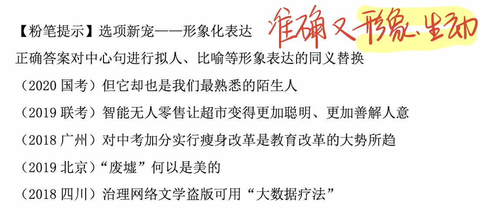
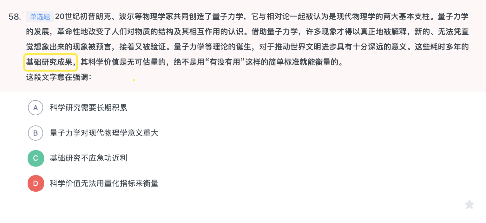
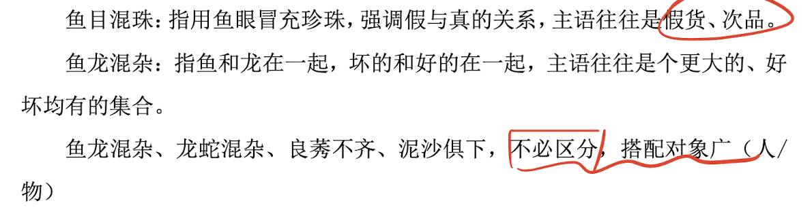
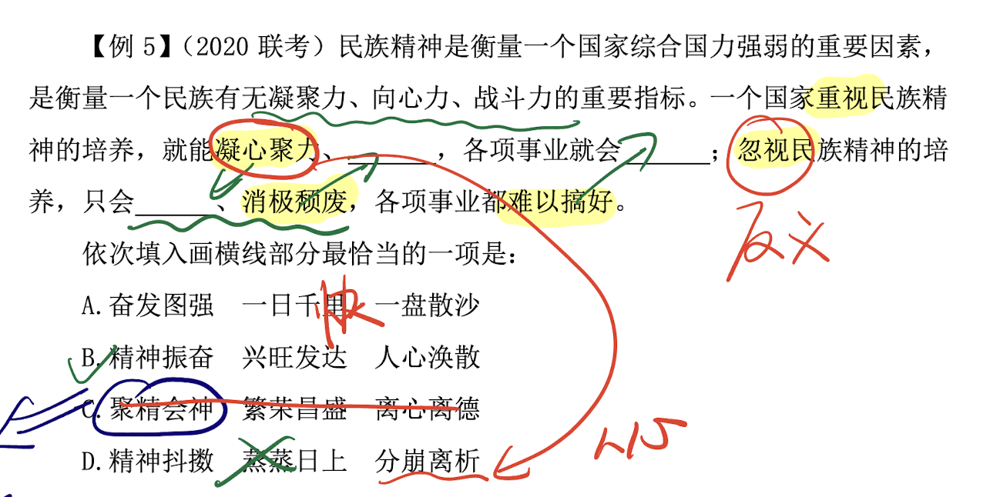
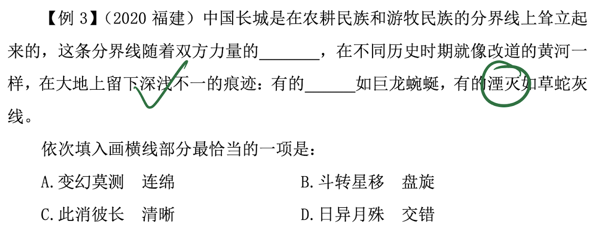
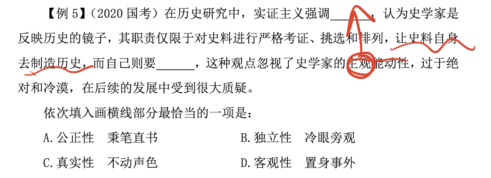
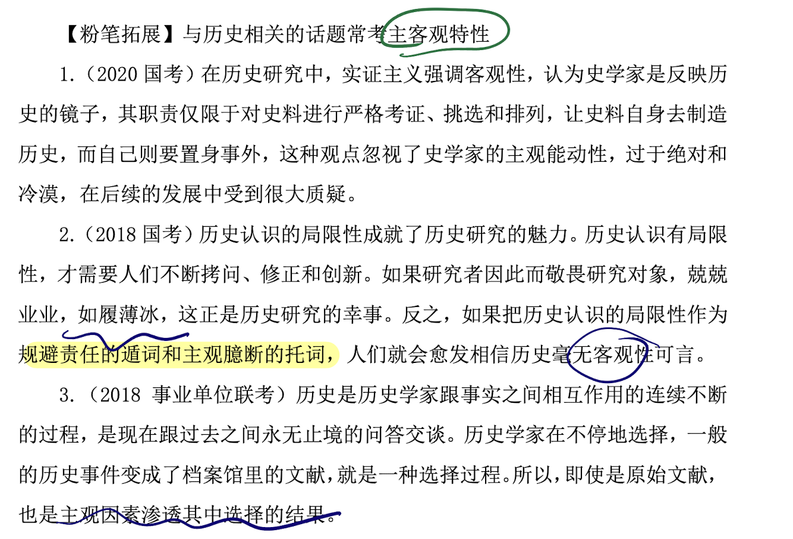

# 言语理解

## 片段阅读

### 中心理解

#### 解题顺序：

提问————文段————选项

#### 提问方式

这段文字主要/旨在/重在/意在/想要说明（论述、强调）的是...

这段文字的主旨/主题/观点是.....

对这段文字概括最恰当的一项是......

#### 解题思路：寻找中心句

有中心句——同义替换（很少有与原文一模一样的句子）

无中心句——把握高频词，此时注意高频词可能有多个，此时答案可能不全面

#### 解题技巧

#### 1、重点词语/关联词

##### 转折关系

解题：转折之后是重点

**典型标志词**：

虽然…但是；尽管…可是、；不过、然而、却；其实/实际上/事实上

**非典型标志词**

殊不知；截然不同；截然相反；全新的研究；一种误读；相对而言；类似于

逆向思维：

转折前后句子意思相反

很多人/大多数人/不少人/传统观点认为+++转折表述

>**错误**选项特征：1.转折前的内容 2.围绕例子的表述 3.**无中生有** 4.偷换概念 5.范围扩大或缩小
>无中生有:
>偷换概念 主题词【偷换/范围扩大或缩小】
>解题：正确答案需要包含文段主题词
>提示:【一个主题词找准，两个主题词找全】

**略读句子特征（不重要信息）**：

>例子：比如、例如、诸如、譬如等
>原因：因为、由于、：、————等
>背景：近年来、随着、在……背景下等

**主题词**

>定义：文段围绕的核心话题
>判断方法：1.一般前有引入或后有解释说明 -出现频词相对较低。2.每句话都围绕相同话题——出现频次高

##### 因果关系

解题：结论是重点

>**典型格式**:
>因为……所以……；由于……因此……
>引导结论的标志词：
>1.所以、因此、因而、故而、于是、可见、看来、故
>2.导致、致使、使得、造成……
>提示:
>1.若尾句出现结论词，大部分情况下是对前文的总结，尾句通常为文段的中心句。

选项新宠————形象化表达

正确答案对中心句进行拟人、比喻等形象表达的同义替换。

**错误选项特征**:

>非重点
>1.转折前的内容
>2.围绕例子的表述
>
>结论词之前的内容
>
>无中生有
>偷换概念 主题词【偷换/范围扩大或缩小】

##### 必要条件关系

典型格式：只有……才/方……

解题

必要条件是重点，

必要条件即"只有"和"才"之间的部分（对策）

###### 常见对策（解决问题）标志词：
>
>对策常考很重要！
>
>应该、应当、必须、需要、当、要、须+做法
>
>通过/采取…手段/途径/措施/方式/方法/渠道，才能……
>
>前提、基础、保障
>
>负有…义务/…的必由之路/…的法门之一/要领之一/势在必行

###### 问题标志词：

>挑战、瓶颈、软肋、难题、不足、缺陷、风险
>提示：识别不明确选项：追问一句选回答

###### 文段特征/行文脉络：

根据内容和结构来把握

提出问题+分析问题+**解决问题**

提出问题+**解决问题**+解释说明/意义效果

**对策**+正反论证/原因论证

###### 反面论证

如果/倘若/一旦……+不好的结果

把前面的做法反过来，即为正确答案

错误选项：有关假设变成现实的表述

**提示**：

当文段中只出现"问题"表述时，"解决问题"可能会作为正确答案出现在选项里

###### 对策不万能，要有针对性！

优选针对性对策，没有选问题概括

###### 重点词语之程度词

**标志词：**

>更、尤其、正是、特别是、真正、根本、最核心、最突出、

**非典型标志词：**

>罪魁祸首、深为……而倾倒、堪比

解题：程度词可提示重点位置

##### 并列关系

全面概括

文段特征

>1.包含并列关联词及标点，如此外、另外、同时、以及、"；"
>2.句式相同或相近
>3.按照时间顺序展开，如古今对比等

解题：正确答案要全面概括

错误选项特征：表述片面

提示：

###### 时间顺序展开的并列 VS 古今对比

时间顺序展开的并列

至少三个方面，且无其他关联词引导

>夏朝……；商朝……；秦朝……；东汉……
>早期……此后……如今……
>第一次……第二次……第三次……第四次

###### 古今对比：

两个方面，且有转折/程度词表强调

>过去……现在则是……
>以往……但是今天……

#### 2、行文脉络

写作思路或机构，不能只看某个重点词

**定义：**由中心句和分述句组成

**解题：**把握中心句和分述句特征

中心句

>形式：重点词提示
>内容：观点（对策、结论、评价）

分述句特征

>分述句不重要，前面或后面的中心句才是重点
>举例子：比如、例如、…就是例证、人名、地名、书名、事件……
>数据资料
>正反论证
>原因解释
>并列分述
>不同主体观点：一方面…另一方面；分类。

##### 1.总————分

中心句为不同类型的解释说明

核心句多出现在文段开头位置

一方面要把握中心句特征；另一方面要了解5种分述句起到解释说明的作用，非重点。

##### 2.分————总

1.结论、对策

2.代词（"这""此"）引导的尾句需关注

前文出现一些内容，尾句通过"因此"引导结论，结论是重点；

**常考标志词**

>这/此/对此/有鉴于此/尽管如此/在这个意义上/从这个角度来说等

**尾句有引导词起到总结作用，标志词之后是对前文的总结概括**

>总之、换言之、简而言之、换句话说

##### 3.总————分————总

##### 4.分————总————分

##### 5.分————分【并列关系】

#### 选项陷阱

>尾句内容迷你眼，并非全部是重点
>非重点处设陷阱，无中生有需警惕

### 细节理解

#### 提问方式

审题很重要，一定要仔细【问题遇到否定词，一定要标记，注意】

>以下对文段理解正确/不正确的是……
>符合/不符合这段话意思的是……
>从文段可以推出/得知的是……

#### 做题顺序

从文段特征看

**晦涩难懂**：从**选项**入手，再回文段做比对

**通俗易懂**：从**文段**入手，再看选项

从选项特征看

若明显，则先看选项

#### 易定位特征

**"三字一号"**：数字、字母、名字、标点

**核心名词**：

孤雌生殖或依赖雌性特有化学信号中的"**孤雌生殖、化学信号**"，

使用超材料能够反弹雷达波中的"**超材料、雷达波**"

能够反弹雷达波中的"超材料、雷达波"。

#### 错误选项类型

1. 无中生有

2. 偷换概念（替换、混搭）

3. 偷换逻辑（强加因果、因果倒置）

4. 偷换时态
   - 将来时（将要、立刻、趋势、以后、有望、如果……）
   - 完成时（已、已经、完成、了、过……）
   - 进行时（正在、在…中、着、尚未完成……）

#### 快速解题技巧

作为"错误项"概率更高

##### 1.对比项

#### 标志词：

A比B更

A高于/优于B

利大于弊……

##### 2.相对绝对项

**绝对表述，错误表述较多**
一定、必定、都、所有、全部、永远……

**相对表述,作为"正确率"概率更大**
可能、也许、往往、之一、或许……

**否定词+绝对表述=相对温和的表述,作为"正确率"概率更大**
不完全、并非绝对……

## 语句表达

### 语句排序题

解题技巧————对比择优（选项和文段标志结合看）

#### （一）根据选项提示，对比后确定首句

1. 下定义

- …就是/是指

2. 背景引入

- 随着
- 近年来
- 在……大背景/环境下

3. **非首句特征**
   - 关联词后半部分
       然而、同时、特别是
   - 指代词单独出现，指代不明确
       人称代词：他/她/它/他们
       致使代词：这/那/此

#### （二）确定捆绑集团/确定顺序/确定尾句

##### 1.确定捆绑集团

**指代词捆绑**

这、那、他、该、其、这些、它们……

**关联词捆绑**

>①配套出现：不但……而且……
>考虑先后句
>②单独一个（但、同时 分析句子意思）
>往往在句式上一致或相近
>①转折：然而、但
>②并列：同时、同样、另一方面、也

##### 2.确定顺序

时间顺序

>具体年份（2017年、2018年）
>朝代（唐宋元明清）
>时间词（过去、现在、将来）
>后来————表示过去

逻辑顺序

>①观点+解释说明
>例如、原因、列数字
>②A和B
>A前B后

##### 3.确定尾句

一般是结论/对策

结论+对策，完美的尾句，结论或对策一般是尾句，但不一定，要对比

因此、所以、看来、于是、这、应该、需要、这……引导的总结性尾句

#### （三）验证（至验证基本锁定的答案，而非全部验证）

### 语句填空题

#### 提问方式

填入画横线部分最恰当的是……

#### 解题技巧

##### 横线在结尾

分总结构，话题要一致

1.总结前文

2.提出对策

##### 横线在开头

总分结构

需对后文进行概括

##### 横线在中间

承上启下

注意与上下文的联系

把握好主题词，保证话题一致

### 接语选择题

#### 提问方式：

作者接下来最可能讲述的是……

#### 解题技巧

重点关注文段最后一句话

**核心话题**要和下文保持一致，结合前文一起判断
​

#### 错误项特征

文段中已经论述过的内容

前文已经说过的排除

### 逻辑填空

难度高原因:
​1靠语感【从文段寻找解题线索和提示】
​2词汇量【高频词语】————粉笔快练小程序，学习强国新思想，人民日报评论性文章，刷真题【每日20逻辑填空】不认识和有出入的词
​

#### 一、词的辨析

**词义侧重**

辨析方法
>1.用不一样的字组词
>2.整体进行搭配组词

##### **固定搭配**

常用词/热点词搭配

从搭配对象角度找两份法:

>❶人/物、
>❷上对下，下对上（eg：犬子、令堂）
>❸具体/抽象（eg：界限、界线）
>❹主动/被动（eg：压制、受制）
>❺谦/敬…

**找准搭配对象————瞻前顾后**

##### 固定搭配积累

##### 程度轻重

所填词语的**程度轻重**要与文段意思的**轻重**保持一致

##### 程度轻重积累

文段中出现更、甚至、乃至、遑论等词语时，**语义程度前轻后重**

骇人听闻 VS 耸人听闻、危言耸听

##### 感情色彩

1.包括褒义、中性、贬义

2.所填词语的感情色彩要与文段的感情色彩保持一致

##### 情感色彩积累

#### 词语积累（陌生、易混）

"短小精悍"形容人身躯短小，精明强悍，也形容文章或发言简短而有力

鳞次栉比：建筑物多而整齐；星罗棋布：数量多、分布广；错落有致：事物的布局参差不齐但极有情趣。

#### 二、语境分析

##### 关联关系
###### 1.转折关系

标志词:

但是、可是、然而、却、其实、实际上等

理论要点

前后语义、感情色彩相反

###### 2.因果关系

标志词：

因为……所以；由于……因此；导致；使得等

理论要点

横线前后构成因果关系

###### 3. 并列关系

**同义并列**

标志：顿号、逗号

解题要点：前后语义相近

逗号（，）连接四字成语

**反义并列**

前后构成，语义相反

不是…而是；是…不是；相反；反之；多一些…少一些；要…不能…等

标志句式:句式相同或相近

##### 对应关系

###### （一）解释类对应

**题干特点**：分句，_____，分句

**标志词**

>即、就是；可谓、可以说、无异于、无疑是……
>前面的分句对后面的空做解释，总结的作用
>标点：冒号（：）、破折号（————）

**如果无标志，通过前后分句对横线处进行解释说明**

……，_____，……(eg:信用卡的实质就是_____我们，让我们感觉不到付账的痛苦)

理论要点：所填词语与解释说明的语句形成语义对应

主观、客观特性积累

###### （二）重点词句对应 

**形象表达**

标志：

比如、有如、就像、类似、""等

答题要点

所填词语与形象表达的词语形成对应

**指代词**

这、此、那、彼、他

**答题要点**：所填词语与代词指代的内容形成对应

**主题词**

答题要点

所填词语与主题词形成对应

**前后呼应**

答题要点：

所填词语与前后文内容形成对应

