# 资料分析

## 资料分析基础概念

### 常见名词

**基期|本期**

与谁相比，谁就是基期（前期）

当前所处的时期 本期（现期）

**增长率|增长量**

也即 增长速度。增长幅度

**增长量**，表示的是本期与基期之间的绝对差值，是一绝对量。【具体值】

**增长率**，表示的是本期与基期之间的相对差异，是一相对量。【相对量】

在一般情况下，"增长率"等价于"增长速度(增速)"等价于"增长幅度(增幅)"。

【说明】

增长了**2.5倍**=增长率为**250%**=是原来的**3.5**倍（**K+1**）

"最值"比较题

>增加（长）**最多 ==&gt; 增长量** 比较，即比多少
>增加（长）**最快 ==&gt; 增长率** 比较，即比快慢
>**变化**幅度最大 **==&gt;** 增长率的**绝对值** 最大，不考虑正负
>**增长**幅度最大 **==&gt;** 增长率的**实际值** 最大

对变化的理解

>增速最快-【上升】最大的
>降幅最大-【下降】最大的
>变化幅度最大-【变化的绝对值】最大的

**同比|环比**

同比，指的是本期发展水平与**历史同期**的发展水平的变化情况，其基期对应的是历史同期。

环比，指的是本期发展水平与**上个统计周期**的发展水平的变化情况，其基期对应的是上个统计周期。

**环比** 常出现在 **月份、季度** 相关问题，尤其在多个柱状图的图表题中容易找出比较对象，需要注意。

**百分数|百分点**

百分数，表示的是将相比较的基期的数值抽象为100，然后计算出来的数值

用"%"表示，一般通过数值相除得到

**百分数的常用情况**
>部分在整体中所占的比重
>表示某个指标的增长率
>百分点，表示的是增长率、比例等以百分数表示的指标的变化情况，一般通过百分数相减得到,通常用在两个增长率、比例等以百分数表示的数值的差值

**倍数|翻番|成数**

倍数，指将对比的基数抽象为1，从而计算出的数值。

翻番，指数量的加倍，翻一番即变成原来的2倍。所用的公式为:本期/基期=2^n，即翻了n番。

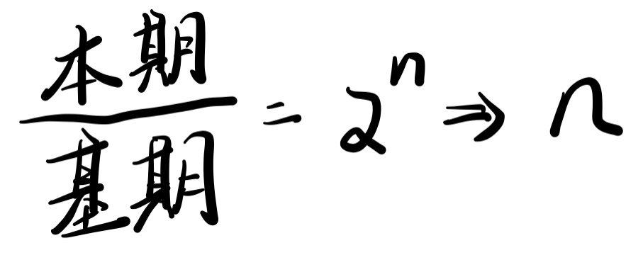

成数，一成为总量的10%，二成为总量的20%，以此类推。

**比重|比值|平均**

**比重**
——某事物在整体中所占的分量

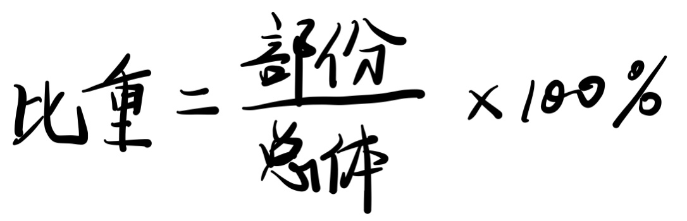

若题目中出现"**占**"字时，考察的即是比重问题。

整体中各部分的比重和为100%，若整体由A, B两部分组成，则A提升的比重等于B下降的比重。

**比值**
——两数相比所得的数值

平均，将总量分成若干份，"均"字之前、"每"字之后的量做分母，可记为"**均前每后做分母**"。

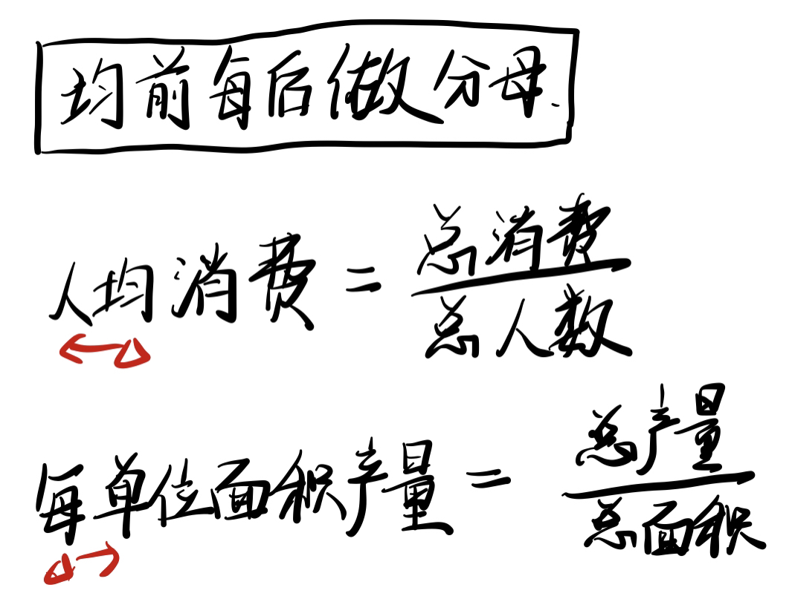

**进出口相关**

该类问题需要谨慎识别，所问问题是进口、出口还是进出口相关;
是"额"(单位一般为美元)还是"量"(单位一般为吨)。
顺差、逆差:贸易出口额大于进口额为贸易顺差、反之为逆差。

**三大产业|产业增加值**

产业增加值:该行业在周期内(一般以年计)比上个清算周期的增长值。该描述为固有名词，为本期量，切忌与增长量混淆。【即一年内的总产值 **==&gt;** GDP】

**五年计划**

2021-2025年，称之为"十四五计划"。

21年第一秒到25年最后一秒【20年末数据-25年末数据】

### ABRX四量的关系

**ABRX**

A-前期

B-本期

R-变化率

X-变化量

**关系**

已知两个求另外两个

## 做题实战

### 做题顺序

**先看问题，后看材料，以问题为导向**

**具体顺序**

看资料首句（图表标题），确定**时间**，从问题入手
>1. 分析问题【题型】
>2. 选取关键字
>3. 回原文找关键字所在语段
>4. 圈出数据
>5. 根据问题分析计算

### 结构阅读法

统计材料的类型包括**单纯的文字、表格、图形**以及由这些元素**组成的复合类型材料**

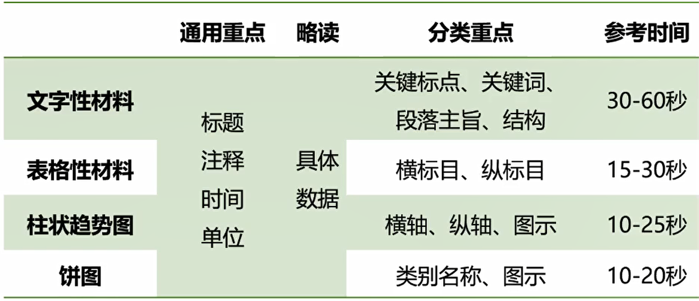

#### 文字材料

阅读重点：结构、关键词、时间、标点

**多段落型**文字材料：**时间**、**关键词**、**结构**

分类信息通过自然段的划分，界限非常明显。

资料分析中的材基本上都是采用 "总-分"结构。

每段中首句中与**数字相关的项目**是考察重点，即应当标记数据以前的关键词

标记段落结构（总分）

孤立段落型文字材料：时间、关键词、标点

孤立段落材料中的信息基本都是采用 "总-分"结构和 "分-分"形式的并列结构出现

#### 表格材料

阅读重点：**横坐标、纵坐标、标题、单位**

>标题：是整个表格材料的**主旨概括**，扼要说明统计**中心内容**；
>横标目：多指研究分析的事物，一般列于统计表左侧相当计表的主语；
>纵标目：用以说明分析事物的数据或指标，一般列于表上的上行相当于统计表的谓语；
>单位：出现在标题或者纵目中，表示各个指标的单位（关注不同的单位）。

#### 图形材料

阅读重点：标题、横轴、纵轴、图例、单位

>标题：简练、确切地说明图的内容，必要时注明时间、地点、描述对象等。一般置于图的下方（或上方）。
>图例：图例是用来指出各种符号和颜色所代表内容的指标，图例必须保持与图形材料一致性和完备性。一般放在图形的下方或右侧；
>单位：出现在横轴或者纵轴中，表示各个指标的单位 （亿吨与万吨|百分号与千分号）

图标查找类注意点：

>去掉修饰语，看准中心语，以免看错坐标
>注意 合计 总计 行，以免误选
>注意 起始、结束的年份和月份
>注意单位

## 速算技巧

### 估算

保留有效数字
公务员资料分析模块估算中，四舍五入最多保留三位有效数字。
保留三位 最大误差量=千分之五
保留二位 最大误差量=百分之五

#### 估算方法

看选项首位

根据下一位来判断当前位，即 不同的下一位是保留位
如：529， 549 ==&gt; 第2位不同，保留3位

选项首位均不同，保留2位

选项首位有相同，保留3位

选项之间的误差

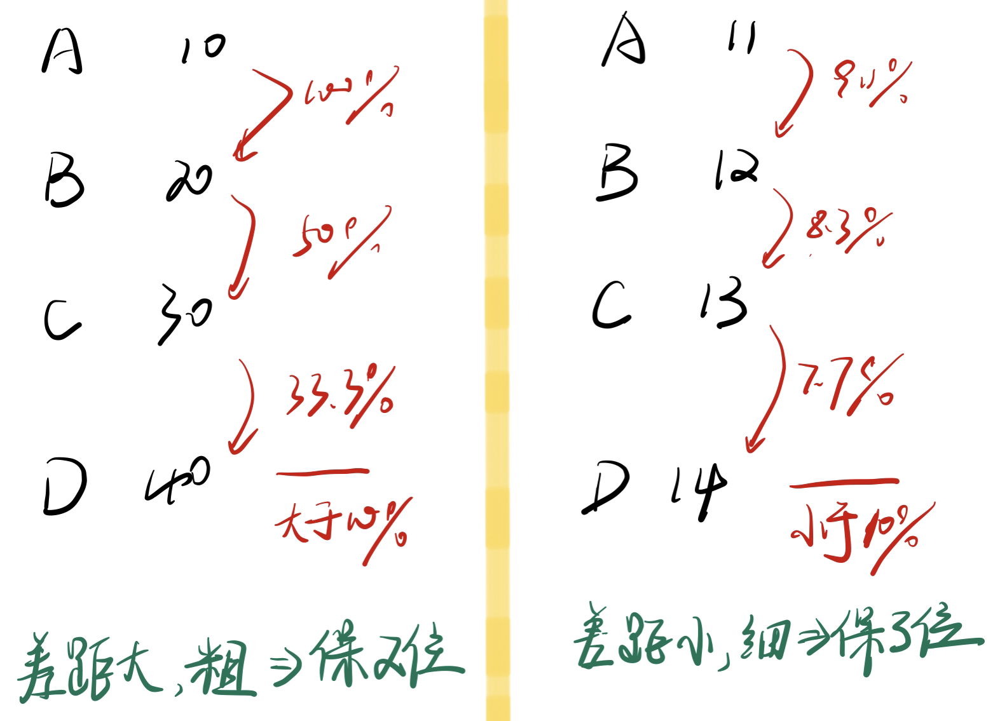

选项之间的误差在10%以上，保留2位

选项之间的误差在10%以内，保留3位

#### 截位直除法

一步除式： 只估算分母即可

分子不要动，只对分母保留有效位数

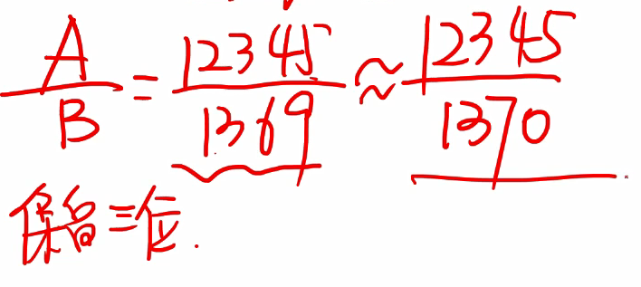

多步连除：分子母同时截位

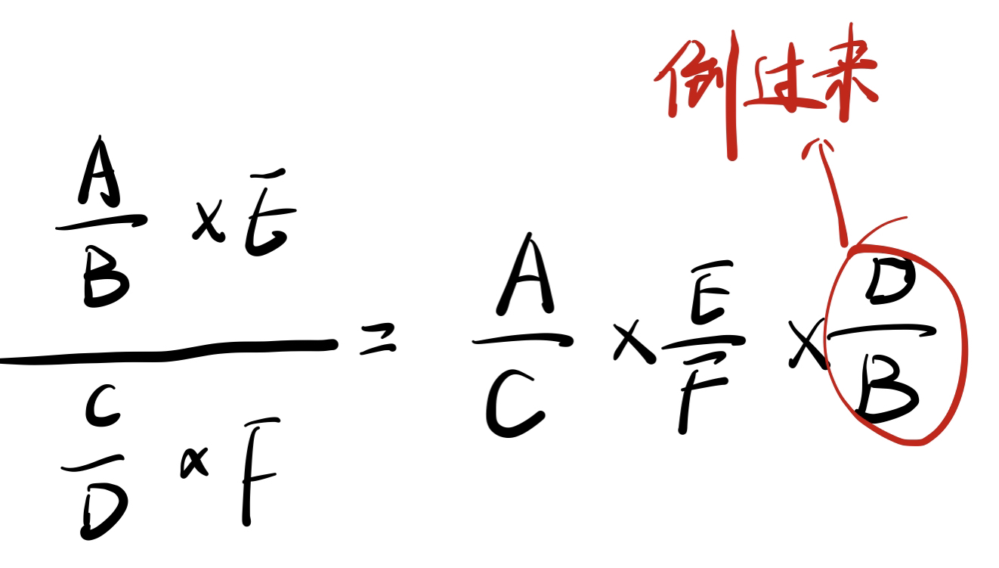

#### 叠除估算

分开估算

整理X1

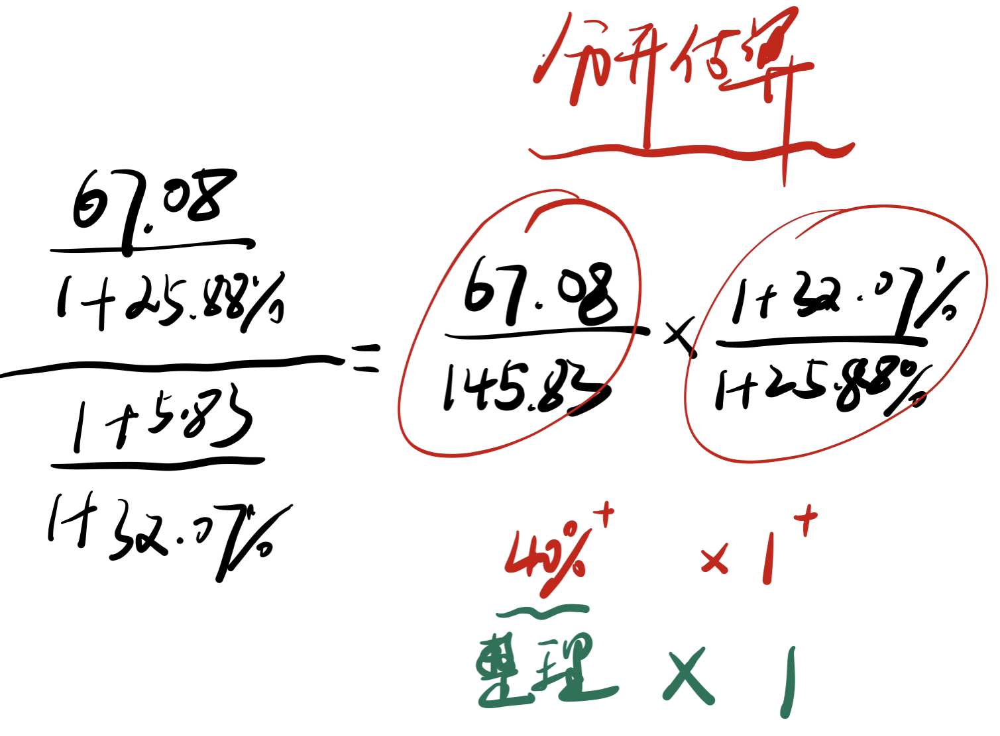

交叉估计

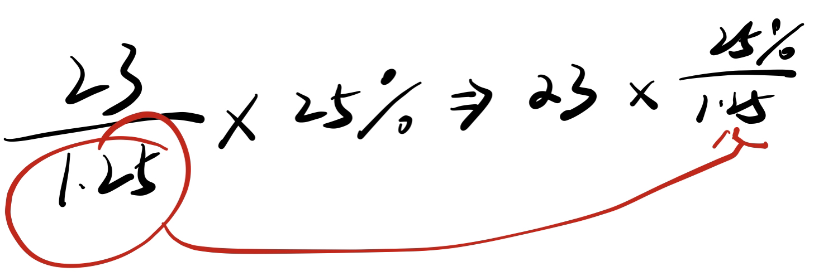

小技巧

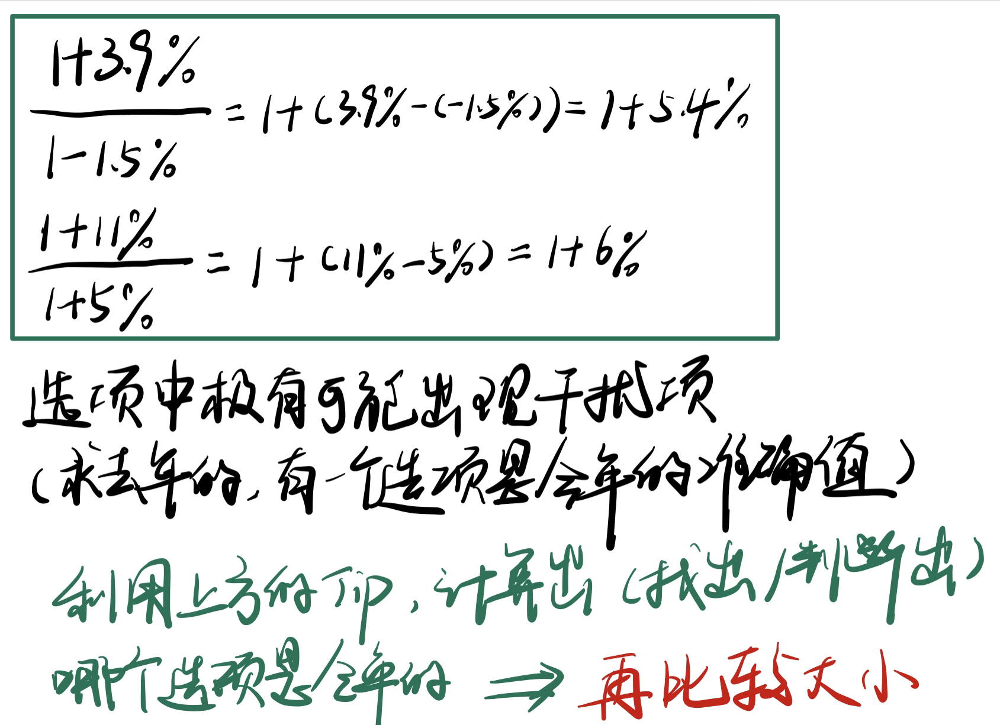

#### 乘法估算

乘法一大一小，按比例增加或减少

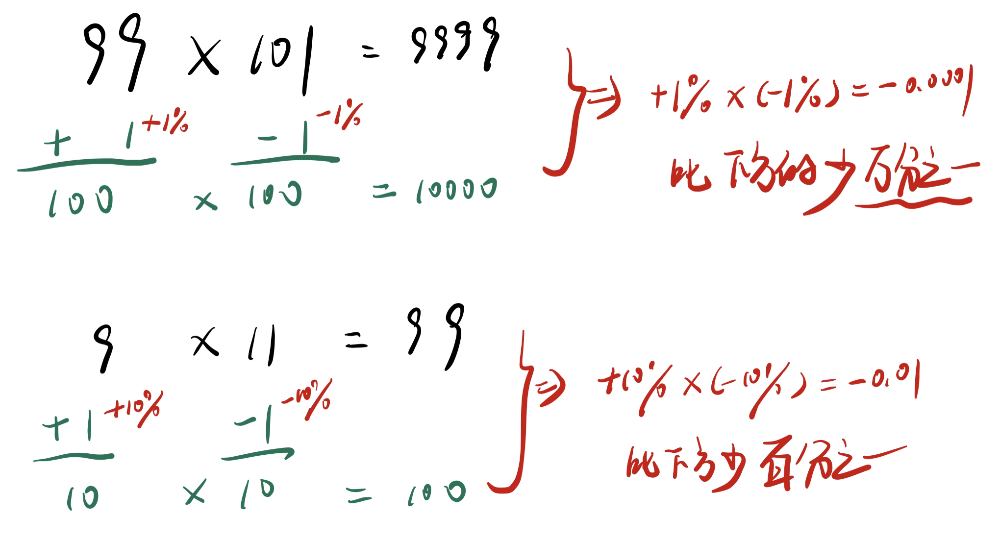

#### 饼状图估算

利用二分法的思想

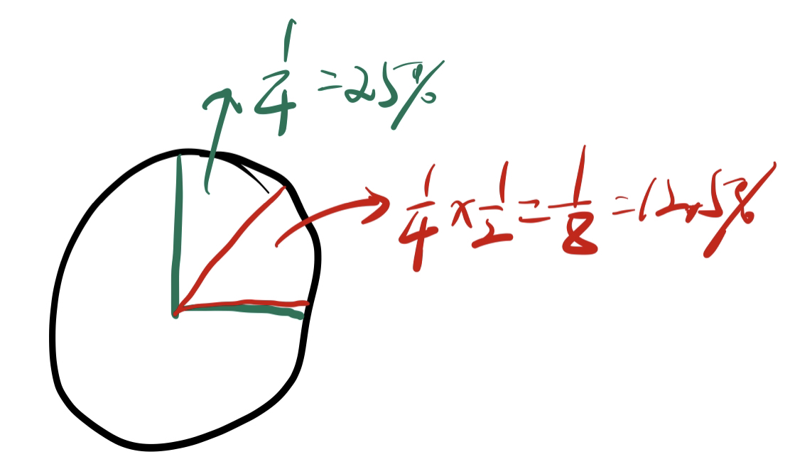

#### 分数

特殊分数

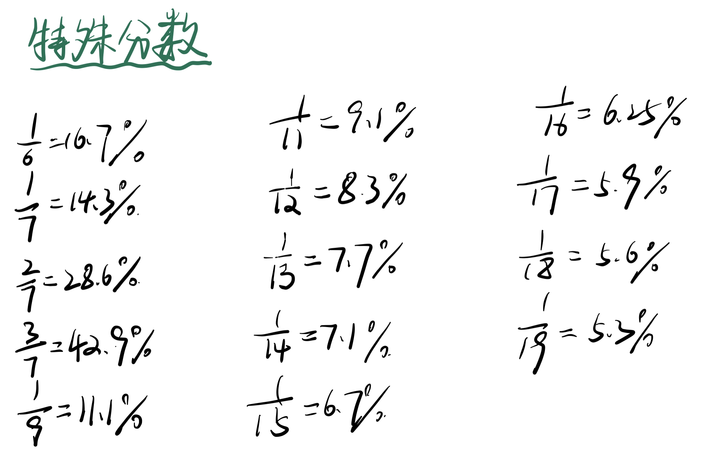

分数比较

#### 难点：分子分母同时变化

1. 直除首位：分别计算出第一个非0的数，比较大小

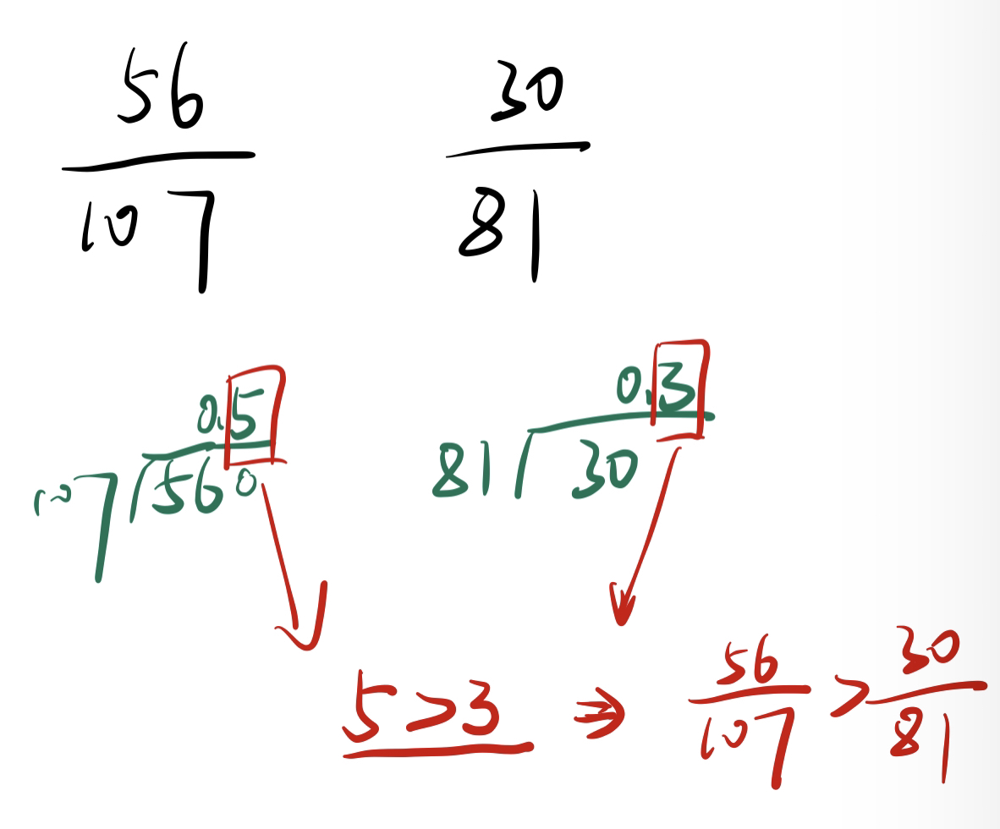

2. 看变化速度：
    分子增速 &gt; 分母 ==&gt; 分数变大
    分子增速 &lt; 分母 ==&gt; 分数变小

### 四则运算技巧

#### 加法-尾数法、高位叠加法、削峰填谷法

##### 尾数法

结果精确（保证尾数是确定的）适用于求 **和、差**

**使用方法：**
1. 先看选项，最后一位不同，看最后一位，最后2位不同，看最后2位
2. 观察选项，在倒数第几位出现完全不同，就观察末位几位。

##### 高位叠加

和我们记忆中的列竖式做加法顺序正相反，高位叠加是**从高位加起**，抓住问题的主要矛盾。

**非精确求和**或没有选项可以参考时，可以选用高位叠加法。

操作：错1位；不到10就前方加0

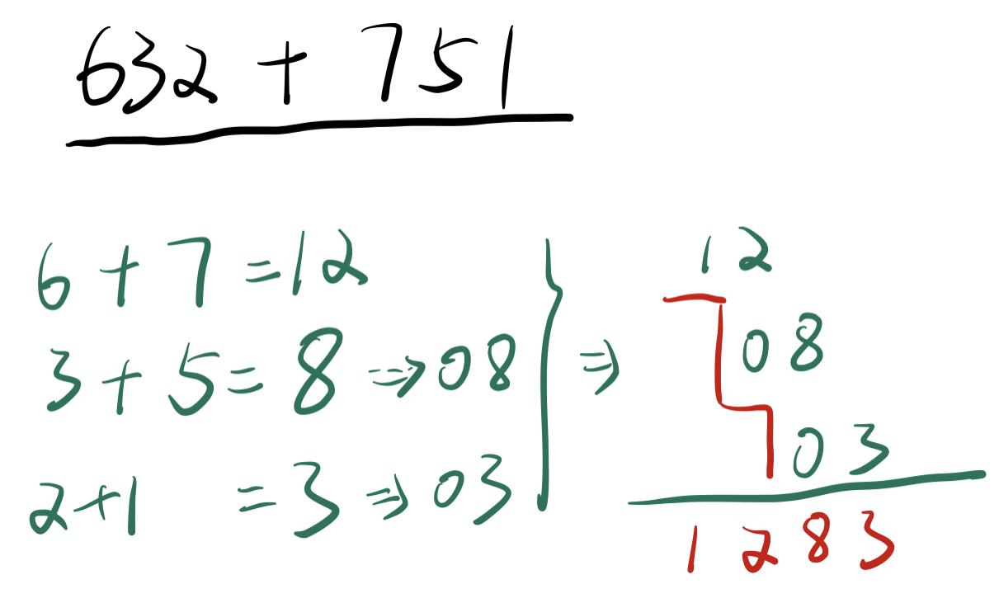

##### 削峰填谷

若几个相近数字求和，可以先**找出基准值**，再根据"偏离总和"求得总和或平均值。

基准值应选择出现次数最多的，减少计算次数

#### 减法-21分段法、整数基准值法

##### 整数基准值法

被减数-减数=(被减数-基准值)+(基准值-减数);

例如"632-589",我们可以加入600作为基准值，则632-589=(632-600)+(600-589)

##### 21分段法

将三位数如222的减法分成"21"或"12"两段，尽可能保证不用借位

#### 乘法-小分互换法

小分互换:若乘法中有某个乘数可以近似的转化为某个常见分数，我们可以将多位数乘法转化为简单除法计算。

2/3=66.7%；1/6=16.7%；1/7=14.3%；2/7=28.6%；3/7=42.9%；3/8=37.5%；5/8=62.5%；

#### 除法-拆分法

顾名思义，拆分法的本质是将被除数由大到小拆成几部分分别计算，通过逐步分解，从而得出结果。

这与哲学中的抓住主要矛盾、抓住矛 盾的主要方面原理一致，抓住被除数的绝大部分，即使小部分存在误差，对最终结果影响也有限。

##### 拆分法使用规则:

如果分数大小接近1(分子分母相差不大)，可用100%减去;

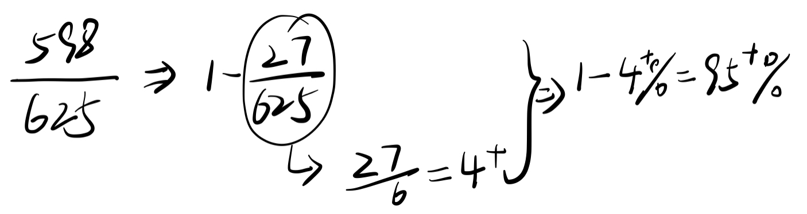

如果分子在分母的50%附近，先拆出50%;

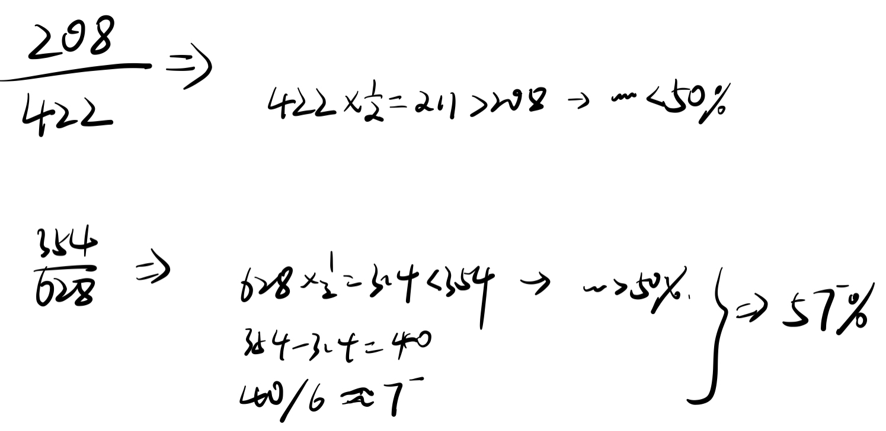

如果分子很小，可根据实际情况拆出10%或5%或1%;
在不满足上述情况时，可根据首位比值，拆出其他特殊分数(例如1/4,1/3, 2/3, 3/4, 4/5等)，此规则运用次数极少，了解即可。

##### 【注意】

在做多位数除法时，分子只保留前三位即可，分母可根据情况保留三四五位，即五位/三位、四位/三位、三位/三位均可。

为方便计算，使用拆分法时可将**分母写成偶数**形式(因经常出现除以2的情况，偶数显然较奇数计算简单)。同理，在拆出1/4时，尽可能将分母写成4的倍数;拆出1/3时，尽可能将分母写成3的倍数。这样到最后，分母就没有了

分子分母要同操作，要舍一起舍，要进一起进

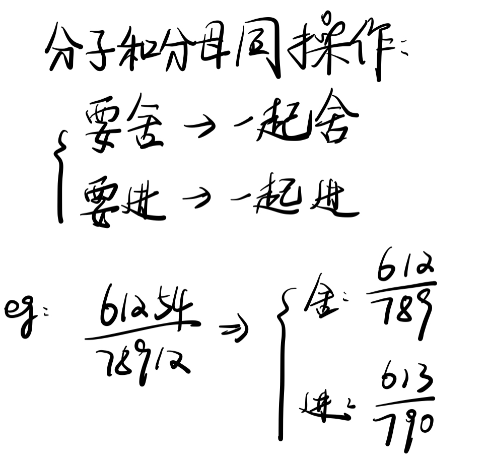

##### 拆分法最常用拆出部分:

50%=分母/2;

10%=分母/10 --&gt;分母小数点向前移动一位;

5% =分母/10 /2 --&gt;分母小数点向前移动一位后再除2;

1% =分母/100 --&gt;分母小数点向前移动两位。

实例

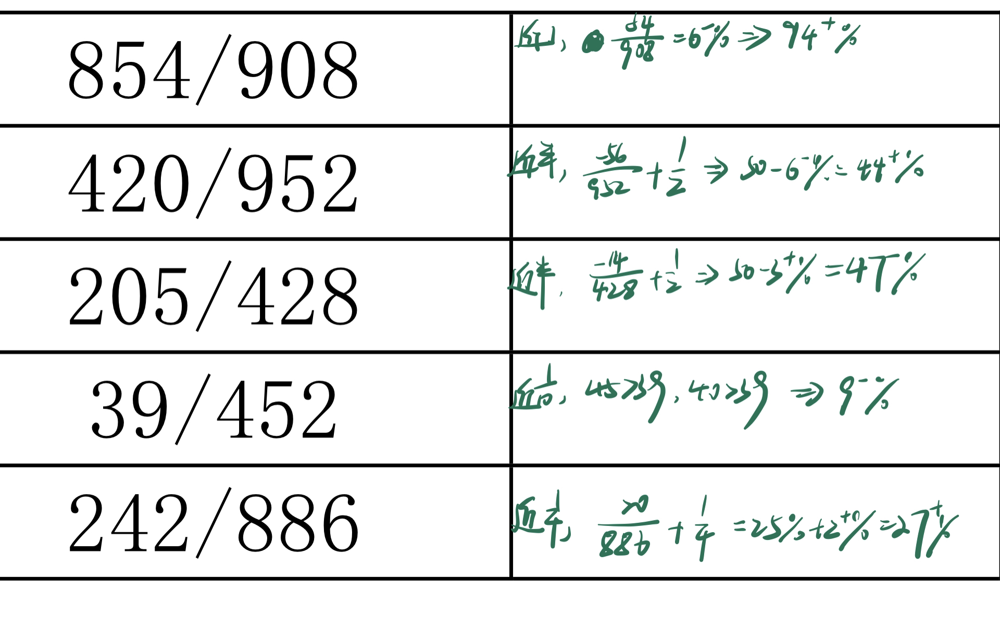

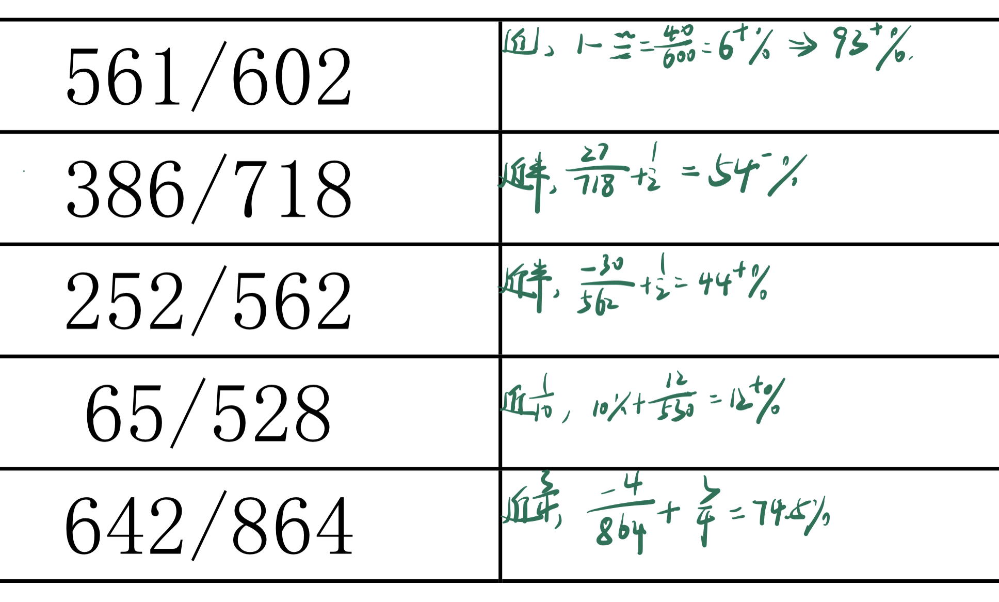

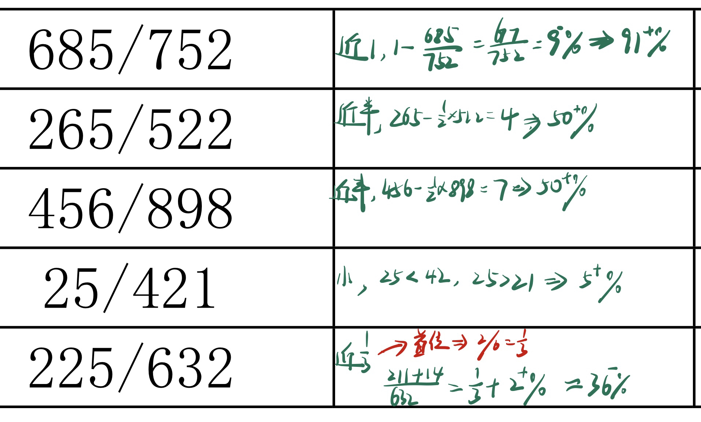

##### 乘法拆分:

乘法拆分:若乘法中有某个乘数为百分数且能拆成两个简单数值(50%, 10%, 5%等)，我们可以将该百分数拆成两部分再相乘。

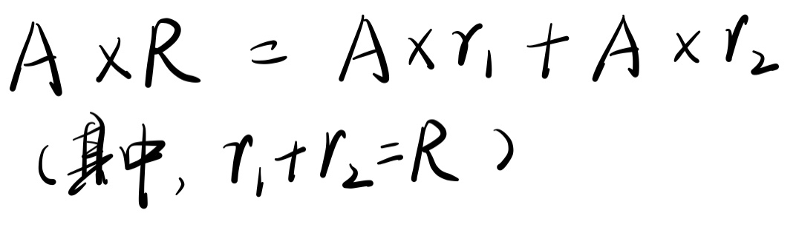

常用的小数拆分

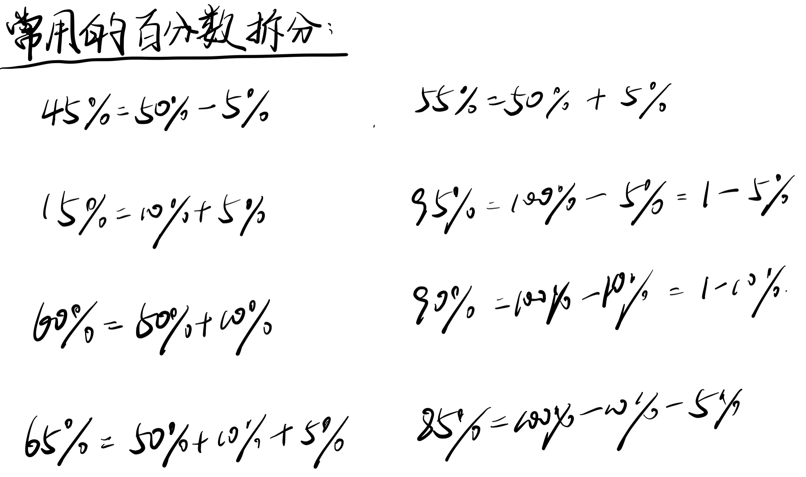

### 特殊运算技巧

#### 415份数法-求增量X

415份数法使用的核心公式为 X=AR和A=B-X

例如:若增长率为25% (25%=1/4)，为方便计算我们可以将基期设为4份，变化量X=AR=1份，本期为基期和变化量的和，即为5份。则基期、变化量、本期的份数分别为4, 1, 5。这也是415份数法名字的由来。

实际上，基期我们可以设置成任意数值，但显然将基期设成和分母(增长率的等值分数)一样大小时，求出的变化量为整数，可以方便下一步计算。

牢记常用分数对应小数，并在选项不是非常接近时，大胆估算。

##### 415份数法使用步骤:

1.将增长率R(百分数)化成相近的分数a/b;

2.写出或在头脑中想出基期、变化量、本期量之比 b:a:a+b (基期为b份，变化量为a份，本期为b+a份);

3.根据本期实际量和其对应的份数求得一份量;

4.根据一份量的大小和变化量、基期对应的份数继续求解。

##### 【注意】

一、增长率为负数

需要特别注意的是，增长率为负数时变化量a也为负数，此时"415份数法"即变成"413份数法"。

413 即 原来的=增长的 + 现在的

二、所求为基期

如果所求为基期，我们一般使用公式A=B-X，而不用一份量X份数求基期。因为估算会产生误差，一份量非实际值，若用一份量X份数则误差被扩大若干倍，可能会导致错误。

三、**【误差估计】**

很多时候增长率R并不与某个分数完全相等，而是将R近似的看成某个分数。估算必然会产生误差，对于估算出的一份量，规则为"**估大则一份变大、估小则一份变小**"(把23%估算成1/4，即是估大了，则求出的一份量比实际量要大;把23%估算成1/5,即是估小了，则求出的一份量比实际量要小)。

除以 小 则 大与真实

除以 大 则 小于真实

乘以 小 则 小于事实

乘以 大 则 大于事实

对415分数法可以用原先的比例进行修正，比如百分之十八点儿几，我们可以用1/6作为415分数法的基准。1/6的话，那就是16点儿几。具离18点儿几还有两个百分点，最终结果的话会跟用415分数法求出来的误差基期的两个百分点

**增长趋势比较法**

在资料分析题目中，经常会碰到比较两个分数(比值、比重等)大小的题目，此时我们可以**根据分子分母增长速度的不同，来判断此分数是否变大或变小**

增长趋势比较法使用的核心公式为B=A X (1十R)

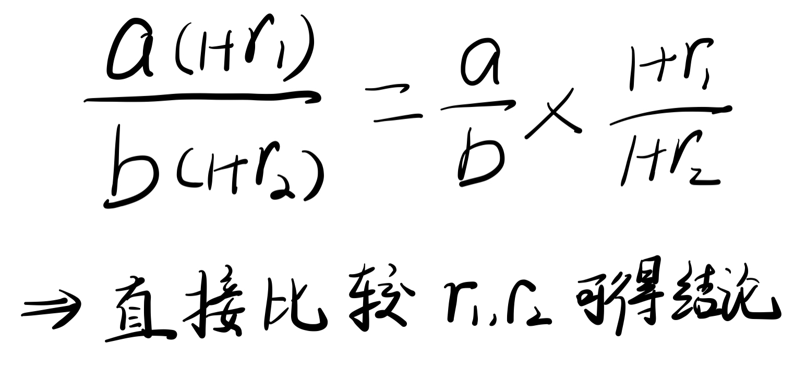

#### 两个分数大小比较判断规律如下:

分子增速大于分母增速，则分数变大(比重上升);

分子增速等于分母增速，则分数相等(比重不变)。

分子增速小于分母增速，则分数变小(比重下降)。

【注】上述规律在增速为负时同样适用，即10%&gt;5%&gt;0%&gt;-5%&gt;-10%

##### 增长趋势比较法使用步骤:

1.确定所求分数的分子分母;

2.在材料中找出或估算出分子、分母的增长率r1, r2;

3.根据r1, r2的大小关系，判断两期分数的大小关系。

【注】若判断两个分数的大小关系，可将分子分母较小的数看做基期分数，将分子分母较大的数看做本期分数。

【注】计算小技巧1，找一个小的基准值

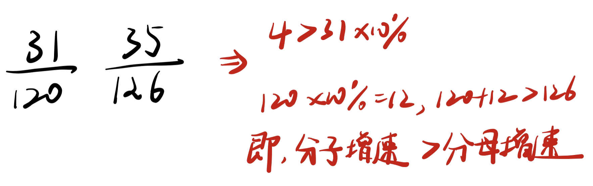

【注】计算小技巧2，盐水思想

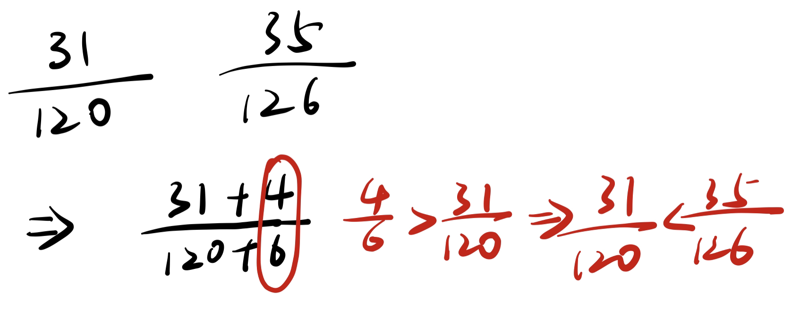

#### 分配法

分配法使用的核心公式为X=AR

##### 分配法使用时机

增长率很小(一般认为小于10%)或增长率不在任何分数附近时，求前期或变化量可以使用分配法:

能初步判断出前期靠近一个整数时，可使用分配法;

当求前期或变化量只是计算过程的中间步骤时，可使用分配法。

##### 分配法使用步骤:

确定被分配数和前期A、变化量X之比;

画出分配树，逐步确定所求量(前期A或变化量X)

记忆口诀:确定分配数，画出分配树

【注】若增长率为负，则变化量也为负，无论"分得"、"返还"均为负数

## 考点-ABRX类问题

### 类型

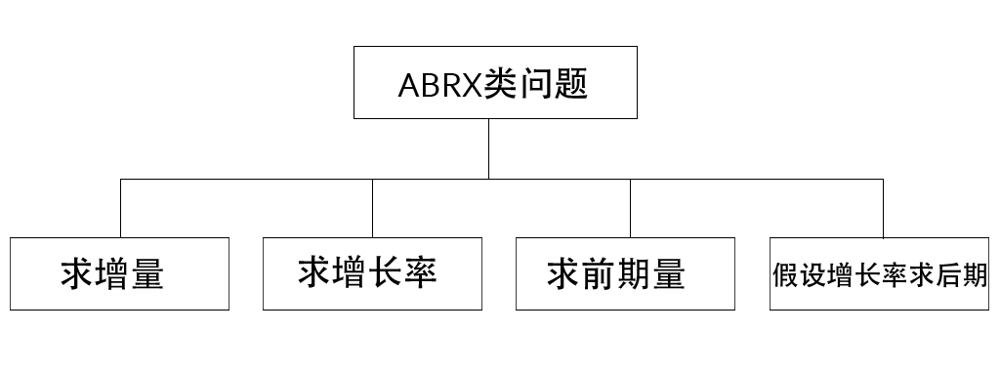

### ABRX的关系

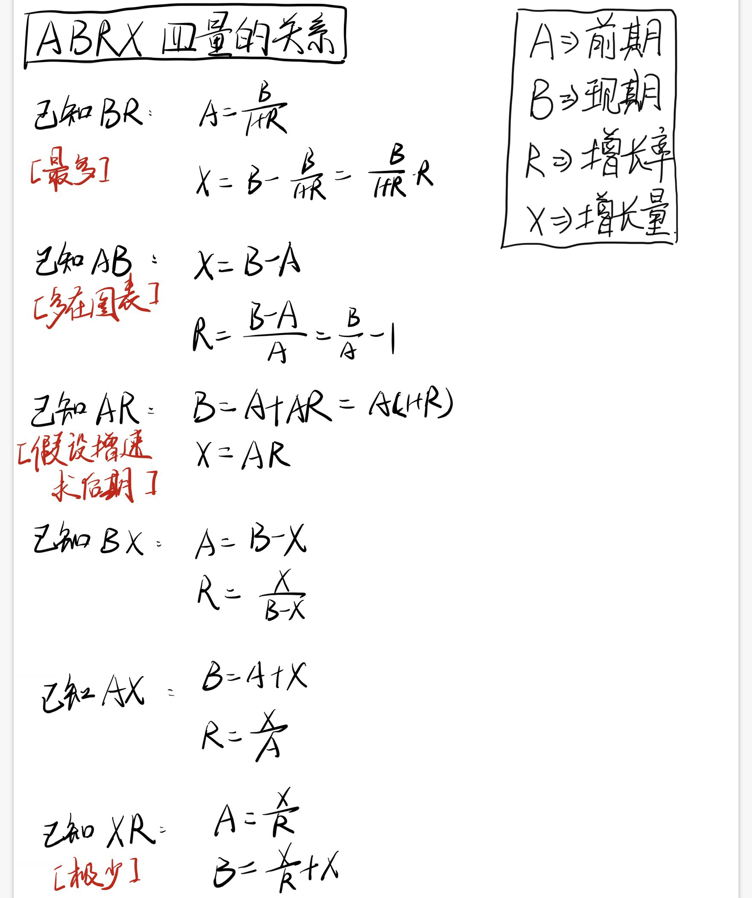

### 增长量X

**增长量的考法与解题技巧**

#### 一般来讲求X会有两类考法:

一是**直接求X**，相对比较简单;

二是求**两个X的关系(或 倍数 或 比值等)**，此类考法只是将两道第一种考法的题目合并到了一道题中。

**求 X 的类型题一般会给出 B, R 做己知条件**，我们可以根据R的大小选择适用的方法:

>当**R&gt;10%**并**靠近某个分数**时，可以选用**415份数法**;估大则一份变大
>当**R&lt;10%**时，可以选用**分配法**;
>当**R非常小(一般为小于5%）**，并且**选项的差距很大**，我们可以**用B*R代替A*R**来求得X（一个估大，一个估小，误差抵消一些）

### 增长率R

增长率的三种常见**考察方式**

#### 基本增长率

己知条件为本期B和基期A求增长率R，可用**R=X/A**求解;

#### 隔年增长率

己知条件为两年的增长率R1, R2，求两年增长率R，可用**R=R1+R2+R1*R2** 求解(例如，14年增长率为R1,  13年增长率为R2，则14年较12年增长率为R1+R2+R1R2

隔年增长率计算中，容易出现**两个百分数相乘**，可以通过小分互换，**把其中一个换成分数**来简化计算

估算技巧

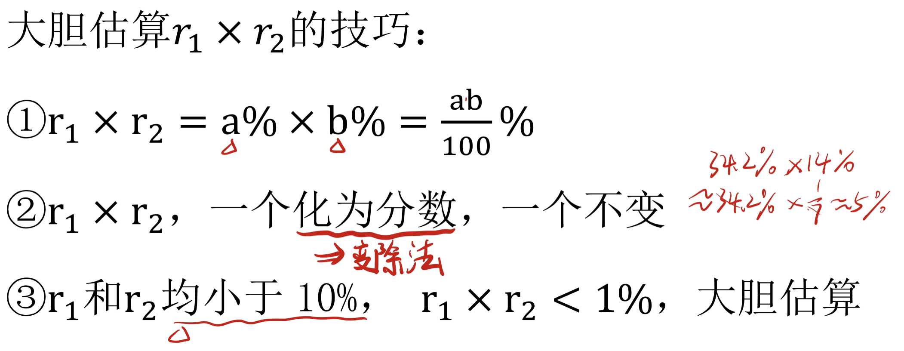

#### 比值增长率

增长率指的是本期比前期增长的情况，但如果本期和前期均为一个比值(A, B)，此类增长率即为比值的增长率问题

绝大多数的比值的增长率问题考察的均为**平均值的增长率**，所以，在问题中看到**"人均""单位面积""平均"与"增长率"**字样，我们就需要考虑是否为此类问题。

比值的增长率，本质上考察的仍然是增长率，和R的前两种考法不同的是，所求的是"比值"而非"数值"的增长率。

**比值的增长率**和比值各**部分的量无关**，结果**只和分子分母的增长率有关**。

##### 比值增长率公式:

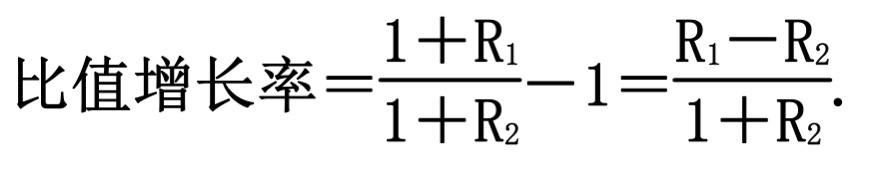

R1 =&gt; 分子

R2 =&gt; 分母

### 前期A

**常见考法与思路**

#### 直接求前期A

我们可以**根据R的大小和选项的差距**选择不同的解题方法:

**选项相距近** =&gt; 直除法，A=B/1+R

**选项相距远** =&gt; 直接代入法、415份数法;

#### 求隔年前期，

可先求出**隔年增长率**，即变成第一类考法;

#### 前期差值，即需要我们求出两个前期再做差;

此类题目求前期时没有选项参考，计算量较大，性价比一般

我们可以先用**追及思想（姚潘）**粗略判断前期差值的情况，排除不符合选项;

若无法秒杀，我们可选用415份数法、分配法、直除法依次求得两个前期。

**追及思想(姚潘理论):**

在**前期差值(非比值)**题型中，我们可以将两个本期量看作为姚明、潘长江两人今年的身高(较大值为姚、较小值为潘)，两个本期量之差即两人今年的身高差。

通过比较两个量的变化情况，我们可能得出三种结论:

>若姚的增长量大于潘的增长量(即姚长的多)，则今年的差距被拉大，前期差值小于本期差值;
>若姚的增长量等于潘的增长量(即两人长的一样多)，则今年的差距和去年不变，前期差值等于本期差值;
>若姚的增长量小于潘的增长量(即潘长的多)，则今年的差距被缩小，前期差值大于本期差值。

总的来说，追及思想即根据本期差距和两者的增量情况，判断前期差距。

**Tips**
两个数相乘，一个数估大一个数估小，误差抵消，结果相对精确。

### 假设增长率求后期（求B）

此类题型(求B)考察次数极少，也相对简单，一般只需要套用公式**B=A+AR或B=A*(1+R)**即可

在相同时间段内，若年平均增速相等，则这10年间的整体增长率也相等。

根据公式R=B/A-1，我们可以得出: 2025量/2015量-1=2015量/2005量-1，即2025/2015=2015/2005。

则2025年水风核电年产量= 2015年水风核电年产量 * (2015年水风核电年产量/2005年水风核电年产量) =52.5*52.5/19.2=143.6百万吨标准煤。

因将来未发生的情况无法判断，所以此类题目一般会让我们根据某一假设的增长率来计算。
B=A (1十R)^n为年均增长率公式。

## 考点-比重类问题

### 分类

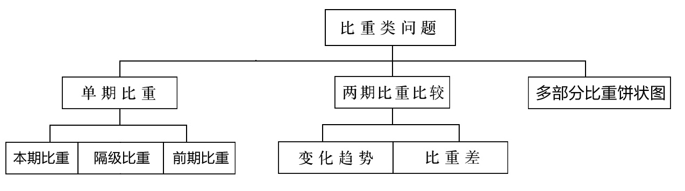

单期比重对应 AB 绝对的值

两期比重比较对应 X 相对的值，做差

### 本期比重

一是最基本也是最简单的考法，即**直接计算某一部分的本期比重**。

此类问题我们只需掌握好**部分、比重、整体三者的关系**即可;

所用公式:

比重=部分/整体;

部分=整体*比重;

整体=部分/比重

二是**多部分本期比重**，或求**部分和**或求**部分差**;

所用公式:

部分和(部分差)=整体*比重和(比重差):

比重和(比重差)=部分和(部分差)/整体

### 前期比重

需要注意的是，前期平均值、前期倍数、前期比值均可看作是特殊的"前期比重"，利用前期比重公式进行计算。

#### 前期比重公式

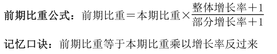

### 隔级比重

指的是题目中存在大集合、中集合、小集合的关系，所问的是小集合和大集合之间的情况。

#### 逻辑：A/C = A/B * B/C

例如，学校为大集合，班级为中集合，班级内的女同学为小集合，若问的是班级内的女同学在学校中的比重为为多少，即是隔级比重。

所用公式: 隔级比重=【小集合(部分)/中集合】*【中集合/大集合 (整体)】

### 变化趋势

与前期比重一样，平均值、倍数、比值也可看作是特殊的"比重问题"，均可利用比重趋势判断方法判断变化情况。

比重趋势判断规律如下:

**分子增速大**于分母，则**分数变大**(比重上升)

**分子增速小**于分母，则**分数变小**(比重下降)

### 比重差

比重差与比重趋势在本质上是一类考法，指的都是两期比重的变化情况。

区别在于比重趋势是定性的分析比重的变化(变大或变小)，比重差是定量的分析比重变化(变大多少或变小多少)。

**比重差公式**: 比重差=本期比重-前期比重=前期部分/本期整体*(部分增长率-整体增长率)

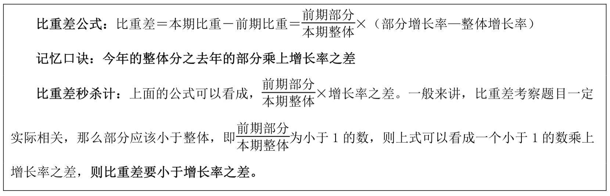

## 考点-比较类问题

### 分类

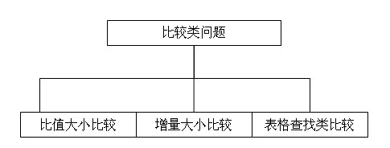

### 比值(增长率、前期)大小比较

常见考法与思路:

>一是前期大小比较，可用A=B/1+R进行比较;
>二是增长率大小比较，可用R=B/A-1（1可以省略)或R=X/A进行比较，基期递增时，也可直接比较X的大小关系:
>三是求增长率超过R的有几个，可用X和A*R进行比较求解
>四是其他比值大小比较，例如平均值、比重相关等

比值大小比较常用方法:

>1、化比值为分数(用+-号进行调节);
>2、用增长趋势判断两个比值大小;
>3、再比值非常接近时，也可用拆分法精确比较

#### Tips

分母持续上升，分子下降，则分数变小

先依次求得2009-2012年增量，因分母持续上升，只需比较根据变化趋势判断分数大小，如果有小于前一项的，这一项必然增速不是最大

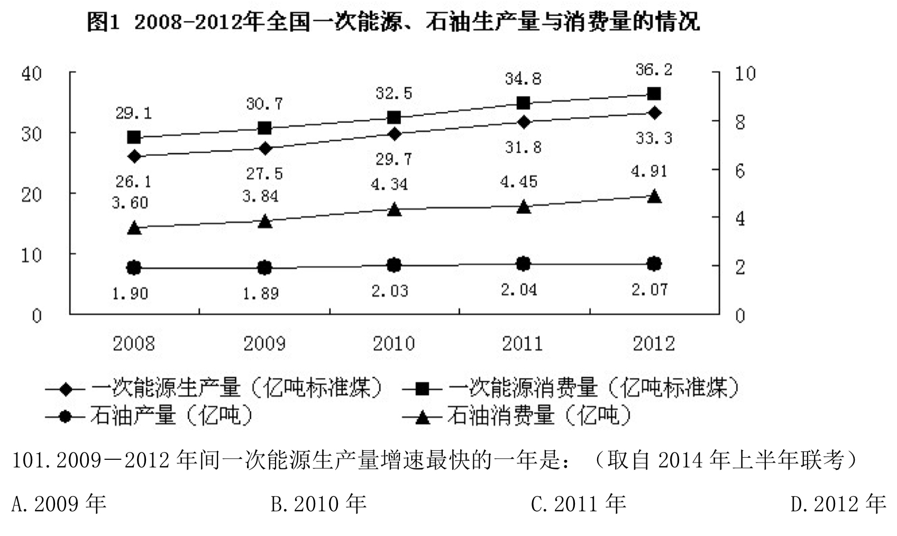

### 增量大小比较

**增量大小比较秒杀:**

#### 第一句:B越大R越大则X越大

#### 第二句:我的B是你的N倍，你的R是我的N倍以上，我们的X才可能相等(N越大，N倍以上越大)

方法：列表比较

### 表格查找类比较

图表查找类问题要注意四点

>一是 去掉定语看准求的是什么，以免看错横纵坐标
>二是 注意"合计""总计"行，以免误选
>三是 注意起始、结束年份、月份
>四是 注意单位(例如航空运输)

## 考点-盐水思想

需要注意的是，资料分析中的增长率R，是针对前期A所言，X=A X R，所以如果要用十字相乘法求解，溶液A, B质量对应的是前期值。

### 两个基本原则

混合溶液浓度要在两杯溶液浓度之间;

混合溶液浓度要接近比重大的那杯溶液浓度。

### 计算方法

#### 线段法-求某种浓度

标点--&gt;按比例分段--&gt;定点--&gt;几何计算

例题

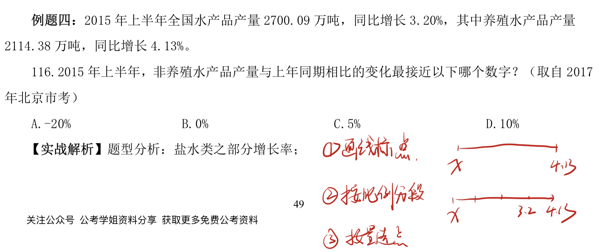

#### 十字相乘法-求两部分量之比

计算方法

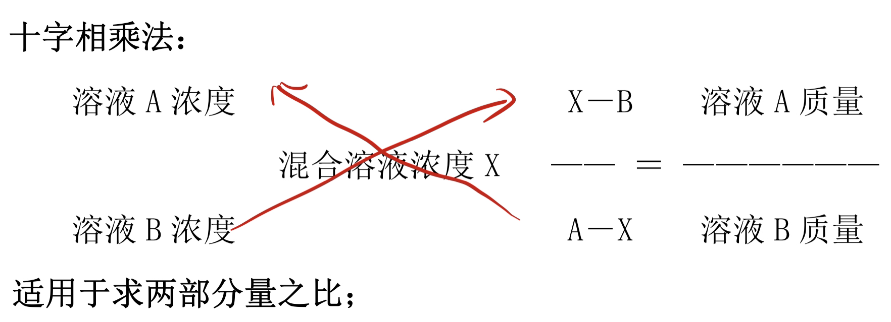

**时间分段**

月份也一样，可以采用盐水思想进行计算

## 考点-平均类问题

### 一般平均值问题

均前每后是分母

### 年均增长量、年均增长率

年均增长量:

表示的是n年间增量的绝对平均值。

年均增量=(本期-基期)/年份差

年均增长率:

表示的是n年间的年平均增速，因为涉及平方与开方，是资料分析中相对较难的知识点，但考法单一容易掌握。

### 公式:

 (1+r) ^N=末期/基期

**代入法:(1.1^4=1.46  1.15^4=1.75  1.2^4=2.07)**

N为本期与基期的年份差，例如本期为2012年，基期为2008年，则N=4

### 特别提示点：对于如何选取起始年份
>一般来讲，对于"2012-2015 年年均增长率是多少"的问题，年份间隔认定是 3 年，起始年份为2012 年
>但有如下几种特殊情况：
>1、若问题是"十二五期间（2011-2015 年）年均增长率是多少"，则年份间隔是五年，起始年份为 2010 年；
>2、若问题是"2011-2015 年这五年年均增长率是多少"，则年份间隔是五年，起始年份为 2010年；
>3、若问题是"2013-2015 年年均增长率是多少"，图表中明确给出了 2012 年的数据，则年份间隔是 3 年，起始年份为 2012 年。

## 考点-特殊问题

拉动增长=部分增量/整体前期

贡献率=部分增量/整体增量
